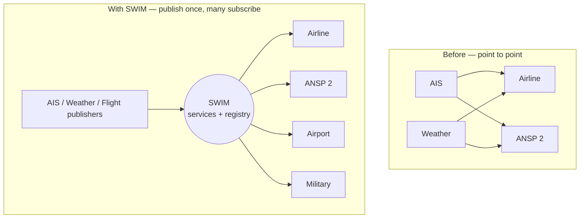

---
tags:
  - aviation-domain
  - swim
  - architecture
aliases:
  - SWIM
  - System Wide Information Management
  - System-Wide Information Management
reading-order: 26
created: 2026-09-01
---
 
# SWIM

> [!abstract] The 30-second version
> **SWIM (System Wide Information Management)** is the move from **point-to-
> point aviation messaging** (send this NOTAM to X, this flight plan to Y) to
> an **"intranet of air traffic management"**: information is published once as
> a **service**, and any authorised system can subscribe to it. It's
> **standards + infrastructure + governance**, not a single product.

## In plain words

Today, a lot of aviation information is passed like formal letters: addressed
from one system to one other system ([[24 — AMHS|AMHS]]). If a new consumer needs the
data, someone has to set up a new connection.

SWIM applies the way the **internet** already works to air traffic management:
a provider publishes a **service** (like a web API or a feed), registers it in
a **catalogue**, and consumers **discover and subscribe** to it. Publish once;
many read. The data itself is in the shared exchange models ([[21 — AIXM|AIXM]],
[[23 — FIXM|FIXM]], IWXXM) so everyone understands it the same way.

## Why it exists

The old one-to-one model doesn't scale to the number of participants and the
volume of data that modern ATM needs. SWIM is the architecture for
**many-to-many** information sharing.

## The parts you actually need to know

### The shift, in a picture

### The four building blocks (ICAO Doc 10039)

| Block | Meaning |
|---|---|
| **Information exchange models** | shared meaning of the data: **[[21 — AIXM\|AIXM]]**, **[[23 — FIXM\|FIXM]]**, **IWXXM** |
| **Infrastructure / services** | how it's carried: service-oriented architecture, web technology, a common network |
| **Governance** | rules, service definitions, a **registry**, security, versioning |
| **Information** | the actual content, quality-assured, with metadata |

It borrows directly from mainstream IT: **service-oriented architecture**, open
standards, web technology — applied to ATM.

### What a "SWIM service" is

A published, versioned interface with: a **service definition** (what it
provides), an **access protocol** (REST / publish-subscribe / messaging),
**security** (authentication and authorisation), and an entry in a **service
registry** so consumers can find it. Examples: an *Aeronautical Information*
service serving [[13 — AIP|AIP]] data sets and digital [[15 — NOTAMs|NOTAMs]]; a *MET* service
serving IWXXM [[18 — METAR|METAR]]; a *Flight* service serving [[23 — FIXM|FIXM]] trajectories.

### Regional programmes

| Region | Programme |
|---|---|
| Europe | **SESAR** SWIM (EUROCONTROL) — technical profiles, the SWIM registry |
| USA | **FAA NAS SWIM** |
| Global | **ICAO Doc 10039** SWIM Concept; the ICAO **Information Management Panel** |

## How it connects to the rest

SWIM is the delivery channel for what [[05 — AIS|AIS]] produces. "Provide our data as
SWIM services" means: model it in [[21 — AIXM|AIXM]], wrap it in a standard service
interface, register it, and let consumers pull it — instead of emailing files
over [[24 — AMHS|AMHS]]. It's also the infrastructure [[27 — TBO|TBO]] needs.

## Jargon buster

| Term | Plain meaning |
|---|---|
| SWIM | System Wide Information Management |
| SOA | Service-Oriented Architecture |
| Publish / subscribe | A provider posts updates; many consumers receive them automatically |
| Service registry | A searchable catalogue of available services |
| SESAR | Single European Sky ATM Research programme |

## Learn more

**Start here (beginner-friendly)**
- SKYbrary — *System-wide Information Management (SWIM)*: <https://skybrary.aero/articles/system-wide-information-management-swim>
- EUROCONTROL — *System-wide information management (SWIM)*: <https://www.eurocontrol.int/concept/system-wide-information-management>
- Wikipedia — *System Wide Information Management*: <https://en.wikipedia.org/wiki/System_Wide_Information_Management>
- FAA — *SWIM*: <https://www.faa.gov/air_traffic/technology/swim>

**Go deeper (the official sources)**
- ICAO Doc 10039 — *Manual on the System Wide Information Management (SWIM) Concept*: <https://store.icao.int/en/manual-on-the-system-wide-information-management-concept-doc-10039>
- EUROCONTROL — *Digitalisation and information management*: <https://www.eurocontrol.int/digitalisation-and-information-management>
