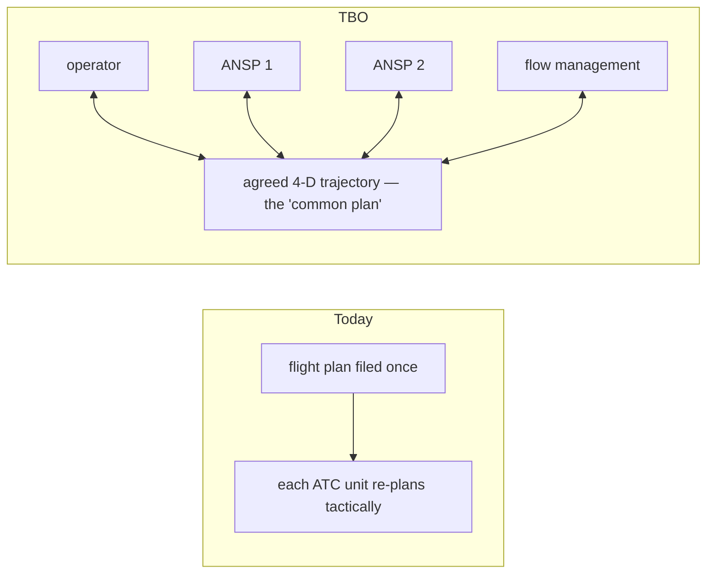

---
tags:
  - aviation-domain
  - future-atm
aliases:
  - TBO
  - Trajectory Based Operations
  - Trajectory-Based Operations
  - 4D Trajectory
reading-order: 27
created: 2026-09-01
---

# TBO

> [!abstract] The 30-second version
> **Trajectory-Based Operations (TBO)** is a future way of running air traffic
> where every flight is managed as **one shared, agreed 4-D trajectory**
> (latitude, longitude, altitude **and time** at each point), visible to the
> operator and every ANSP along the way. Instead of each controller re-planning
> tactically, systems collaborate on the trajectory before and during the
> flight.

## In plain words

Today, an aircraft files a [[19 — FPL|flight plan]], and then each [[03 — ATC|ATC]] unit it
passes through works it more or less independently, issuing tactical
instructions ("descend now", "turn left"). The "plan" isn't really shared.

Under TBO, there is **one trajectory** that everyone — the airline, every
control centre, flow management — sees and agrees on. If something needs to
change (weather, a capacity limit, a military area activating), the parties
**negotiate a revision to the trajectory** rather than the flight being
vectored off-plan. The aim: less fuel, more predictability, fewer holds, and
more capacity without losing safety.

## Why it exists

Because independent, tactical control leaves efficiency on the table and makes
the system hard to predict. A shared trajectory lets everyone plan around the
same picture.

## The parts you actually need to know

### From clearances to a shared trajectory

### The enablers

| Enabler | Role |
|---|---|
| **FF-ICE** (ICAO **Doc 9965**) | the procedures & information for collaborative flight planning and execution |
| **[[23 — FIXM\|FIXM]]** | the data format that carries the trajectory and its revisions |
| **[[26 — SWIM\|SWIM]]** | the network the trajectory and constraints are shared over |
| **[[21 — AIXM\|AIXM]] + AIM** | the synchronised picture of routes/airspace the trajectory is checked against |
| **CPDLC / ADS-C** | data link so aircraft and ground share the *actual* trajectory in flight |
| **PBN** (see [[08 — NAVAIDs\|NAVAIDs]]) | aircraft able to fly precise paths and hit a **required time of arrival** |

### FF-ICE steps

| Phase | What happens |
|---|---|
| **R1 — Planning** | operator submits flight data as FIXM; ANSPs check acceptability, return constraints; iterate before departure |
| **R2 — Execution** | trajectory continuously revised and shared in flight |

### Status

FF-ICE/R1 provisions are published and being trialled and implemented by
leading ANSPs; **R2 and full TBO are still in development** and staged
rollout. Expect "partial TBO" for years before it's everywhere.

## How it connects to the rest

TBO is where [[19 — FPL|FPL]], [[23 — FIXM|FIXM]], [[26 — SWIM|SWIM]], [[04 — ATFM|ATFM]] and quality [[05 — AIS|AIS]]/[[21 — AIXM|AIXM]]
data all come together. The practical takeaway for anyone working on
aeronautical data: **TBO is impossible without digital, quality-assured,
synchronised AIM** — that's the dependency.

## Jargon buster

| Term | Plain meaning |
|---|---|
| TBO | Trajectory-Based Operations |
| 4-D trajectory | 3-D position plus time at each point |
| FF-ICE | Flight & Flow Information for a Collaborative Environment |
| RTA / CTA | Required / Controlled Time of Arrival |
| CPDLC / ADS-C | Controller–Pilot Data Link Communications / Automatic Dependent Surveillance–Contract |
| GANP / ASBU | ICAO's Global Air Navigation Plan / its modular system upgrades |

## Learn more

**Start here (beginner-friendly)**
- SKYbrary — *Trajectory Based Operations (TBO)*: <https://skybrary.aero/articles/trajectory-based-operations-tbo>
- EUROCONTROL — *Trajectory-based operations and FF-ICE* (slide deck): <https://www.eurocontrol.int/sites/default/files/2025-03/eurocontrol-flight-dispatcher-days-ff-ice-r2-and-tbo.pdf>
- ICAO GANP Portal — *Trajectory-Based Operations (TBO) tree*: <https://www4.icao.int/ganpportal/ASBU/TBO/Graph>

**Go deeper (the official sources)**
- ICAO Doc 9965 — *Manual on FF-ICE*: <https://store.icao.int>
- ICAO Doc 9750 — *Global Air Navigation Plan (GANP)*: <https://www.icao.int/airnavigation/pages/GANP-resources.aspx>
- ICAO A41 working paper — *Updates of TBO activities*: <https://www.icao.int/sites/default/files/Meetings/a41/Documents/WP/wp_462_en.pdf>
