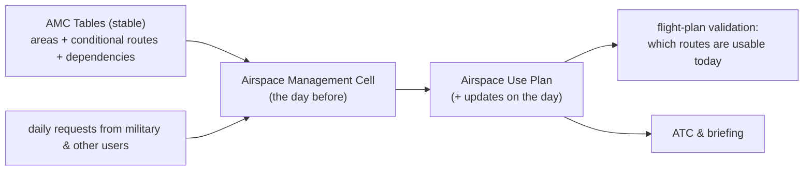

---
tags:
  - aviation-domain
  - airspace-management
aliases:
  - AMC Tables
  - Airspace Management Cell
  - AMC-manageable airspace
  - Flexible Use of Airspace
  - FUA
reading-order: 28
created: 2026-09-01
---

# AMC Tables

> [!abstract] The 30-second version
> Some airspace and some routes are **not permanently fixed** — they're
> **shared between civil and military users and switched on and off day by
> day**. The **AMC (Airspace Management Cell)** decides the daily allocation.
> **AMC Tables** are the aeronautical-data tables that describe this switchable
> airspace: which areas are "AMC-manageable", which routes are conditional,
> and how they depend on each other.

## In plain words

The military needs training areas, but not all the time. Airlines want the
shortest routes, but some of those routes pass through those training areas.
Rather than block the airspace permanently, countries **share it**: the
military books what it needs for tomorrow, and everything it *doesn't* book is
released for civil use.

For this to work, there has to be a **stable description** of every piece of
shareable airspace and every route that depends on it. Those descriptions are
the **AMC Tables**. Each day, the **Airspace Management Cell** uses them to
publish a plan — the *Airspace Use Plan* — saying what's active and what's
free.

## Why it exists

To get the efficiency of "one continuum of airspace, allocated by need"
instead of rigid permanent civil/military boundaries — the **Flexible Use of
Airspace (FUA)** concept.

## The parts you actually need to know

### Flexible Use of Airspace — three levels

| Level | Who | Timescale |
|---|---|---|
| **Strategic** | national civil/military policy body | defines the structures & rules — **the AMC Tables live here** |
| **Pre-tactical** | the **AMC** | the **daily** allocation → the *Airspace Use Plan (AUP)* |
| **Tactical** | [[03 — ATC\|ATC]] units | real-time use; hand back unused airspace |

### What the tables contain

| Table | Contents |
|---|---|
| **AMC-manageable areas** | the restricted / danger / reserved areas whose activation is decided daily, with default hours and vertical limits |
| **Conditional Route (CDR) table** | every non-permanent route segment, its **category**, and which area(s) close it when active |
| **Area ↔ route dependency** | the rules: "when area X is active, route Z is closed" |

### Conditional Route categories

| Category | Meaning |
|---|---|
| **CDR 1** — permanently plannable | available at published times; flight-plan it normally |
| **CDR 2** — non-permanently plannable | available only when announced in the daily plan; plan it only if published for that day |
| **CDR 3** — not plannable | never flight-planned; may be offered tactically by [[03 — ATC\|ATC]] |

### The daily cycle

## How it connects to the rest

AMC Tables are [[13 — AIP|AIP]] and database content that [[05 — AIS|AIS]] maintains — modelled
in [[21 — AIXM|AIXM]] with **schedules** (see [[22 — AIXM Temporality Model|AIXM Temporality Model]]). They link the
[[09 — Waypoints|route network]] to restricted areas, and they drive
[[19 — FPL|flight-plan]] validation and [[04 — ATFM|flow]] planning. They're closely
related to [[12 — ICAO Airspace Classification|special-use airspace]].

## Jargon buster

| Term | Plain meaning |
|---|---|
| AMC | Airspace Management Cell |
| FUA | Flexible Use of Airspace |
| ASM | Airspace Management |
| CDR | Conditional Route |
| AUP / UUP | Airspace Use Plan / Updated Airspace Use Plan |
| TSA / TRA / CBA | Temporary Segregated / Reserved Area / Cross-Border Area |
| RAD | Route Availability Document (the planning-horizon version of route restrictions) |

## Learn more

**Start here (beginner-friendly)**
- SKYbrary — *Flexible Use of Airspace*: <https://skybrary.aero/articles/flexible-use-airspace>
- SKYbrary — *Conditional Route (CDR)*: <https://skybrary.aero/articles/conditional-route>
- EUROCONTROL ATM Lexicon — *Conditional Route*: <https://ext.eurocontrol.int/lexicon/index.php/Conditional_Route>

**Go deeper (the official sources)**
- ICAO Doc 9426 — *Air Traffic Services Planning Manual* (FUA); ICAO Circular on FUA: <https://www.icao.int>
- EUROCONTROL — *Airspace Management (ASM)* and the AUP/UUP: <https://www.eurocontrol.int/service/airspace-management>
- EUROCONTROL Network Manager — *Route Availability Document (RAD)*: <https://www.nm.eurocontrol.int/RAD/>
