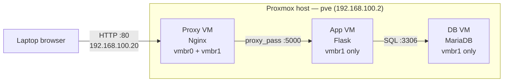

---
tags:
  - proxmox
  - virtualization
  - system-discovery
  - moc
aliases:
  - System Discovery
  - System Discovery Plan
reading-order: 1
created: 2026-09-14
---

# 01 — System Discovery: The Complete Build

> [!abstract] What this document is
> The full record of the **System Discovery** assignment from Hans — what
> was built, every bug hit along the way, why each one happened, and the
> underlying concepts each one taught. Part runbook, part write-up. See
> [[00 — What is Proxmox]] first if "hypervisor," "bridge," or "container"
> are unfamiliar terms.

> [!quote] The actual assignment (Hans's email)
> "Understand what a system looks like from a simple perspective, how
> different components work together, and how requests flow between them
> ... most of the systems we support are made up of multiple services
> working together." Freedom to choose platform/OS/app versions — the
> objective is the *architecture and reasoning*, not a specific stack.

---

## 1 · The end result, at a glance



Three AlmaLinux 9 VMs, each doing one job, talking across an isolated
internal network — a miniature version of exactly the kind of
multi-service system the assignment is about.

| Component | Role | Network |
|---|---|---|
| **Proxy VM** | Nginx reverse proxy — the only thing reachable from outside | `192.168.100.20` (LAN) + `10.10.10.10` (internal) |
| **App VM** | Flask app — fetches data from the DB, returns HTML | `10.10.10.11` (internal only) |
| **DB VM** | MariaDB — holds the actual data | `10.10.10.12` (internal only) |

> [!info] Concept: why a proxy → app → DB shape at all?
> This is the classic **three-tier architecture** — presentation layer,
> logic layer, data layer — and it's not arbitrary: separating these lets
> each layer scale, fail, and be secured independently. The DB never has
> to be reachable from the internet; only the proxy does. Real systems
> supported in MSSP/infra work are almost always some variant of this
> shape, which is exactly why Hans picked it as the learning vehicle.

---

## 2 · Part One — Standing up Proxmox itself

Before any VM existed, the physical system unit had to become a working
Proxmox host reachable from the laptop. This alone surfaced four separate
bugs.

> [!bug] Bug 1 — USB installer wouldn't boot
> **Symptom:** `Found ISO9660 FS but no or wrong PROXMOX cd-id, skipping`
> **Cause:** the write to the USB stick was bad — the ISO's own SHA256
> checksum verified clean against Proxmox's official published hash, so
> the download wasn't the problem; the *flash* was.
> **Fix:** re-flashed with `dd` directly (`dd if=proxmox-ve_9.2-1.iso
> of=/dev/sdX bs=4M status=progress conv=fsync`), which succeeded.

> [!bug] Bug 2 — Direct laptop↔system-unit cable showed `NO-CARRIER`
> **Symptom:** plugging a cable straight from the laptop's Ethernet port
> to the system unit gave a permanent "no link" state — no lights, no
> connection, even though the same port worked fine into a router.
> **Cause:** two end-device NICs wired directly together need
> **Auto-MDIX** (automatic transmit/receive pair-swapping) to negotiate a
> link — a switch does this swap for you, which is why it worked through
> one but not directly.
> **Fix:** routed the cable through a plain unmanaged switch instead of
> point-to-point. Link came up immediately.

> [!bug] Bug 3 — Proxmox had no internet, and its clock was 2 months wrong
> **Symptom:** `apt-get update` failed, and `timedatectl` showed the date
> stuck on the day of the ISO release, `System clock synchronized: no`.
> **Cause, chained:** Proxmox's install-time static IP pointed its default
> gateway at `192.168.100.1` — an address that doesn't exist anywhere on
> the real network. With no route out, `chronyd` tried once at boot to
> resolve its NTP pool, failed, and **never retried** (a known chrony
> behavior — it doesn't re-attempt a failed pool resolution on its own).
> **Fix:** gave Proxmox a *second* address, via DHCP, on the real WiFi
> router's actual network (`192.168.107.0/24`) — while **keeping** the
> original `192.168.100.2` address for the laptop to keep reaching it.
> Then restarted `chronyd`, which immediately resolved and synced.
>
> > [!info] Concept: a host can (and often should) have two addresses
> > One NIC, two IP addresses, two purposes: `192.168.100.2` for the
> > private lab network, `192.168.107.50` for real internet — both live on
> > `vmbr0` simultaneously. This is completely normal; a machine's identity
> > isn't "one IP," it's "every address it's been given," each serving
> > whichever network it needs to reach.

> [!bug] Bug 4 — `apt-get update` still failing after internet was fixed
> **Symptom:** `401 Unauthorized` on `enterprise.proxmox.com`.
> **Cause:** Proxmox defaults to its paid **Enterprise repository**, which
> requires a subscription key that doesn't exist here.
> **Fix:** disabled the Enterprise repo files (`Enabled: false`, kept as
> `.bak` rather than deleted), added the free `pve-no-subscription` repo
> instead. Same packages, same features — just a different, free update
> channel.

**Result after Part One:** Proxmox VE 9.2 running, reachable at
`https://192.168.100.2:8006`, with working internet, a correct clock, and
a clean `apt-get update`.

---

## 3 · Part Two — Building the internal network

> [!info] Concept: network segmentation
> The App and DB VMs never need to be reachable from your laptop or the
> internet directly — only the Proxy VM does. Putting them on their own
> isolated bridge (`vmbr1`, no physical NIC attached) means there's
> **no path in** from outside except through the one component
> deliberately exposed. This is the same principle behind real DMZs and
> internal segments in production networks — it's not extra complexity for
> its own sake, it's the actual security boundary the assignment is
> implicitly teaching.

`vmbr1` was created with the host itself holding `10.10.10.1/24` on it —
but a bridge with just an address only lets *Proxmox* reach that network.
The App/DB VMs still need outbound internet (for `dnf install`), and
nothing on `10.10.10.0/24` has a route out on its own.

> [!info] Concept: NAT (Network Address Translation)
> This is exactly what your home router does for every device on your
> WiFi: many private devices share one public-facing address for outbound
> traffic. Proxmox was configured to do the same thing for `10.10.10.0/24`:
> ```
> post-up echo 1 > /proc/sys/net/ipv4/ip_forward
> post-up iptables -t nat -A POSTROUTING -s 10.10.10.0/24 -o vmbr0 -j MASQUERADE
> ```
> `ip_forward` turns the host into an actual router (Linux refuses to pass
> packets between interfaces by default). `MASQUERADE` rewrites the
> internal VMs' private source address to Proxmox's own internet-facing
> address on the way out — so they get outbound access without ever being
> directly reachable from outside.

> [!bug] Bug 5 — `192.168.100.2` briefly vanished from `vmbr0`
> **Symptom:** total loss of connectivity to Proxmox from the laptop,
> mid-way through building the App VM.
> **Cause:** the saved config file was actually correct — the *running*
> interface state had drifted from it. Almost certainly a stray `dhclient`
> command meant for a VM's own console landed on the Proxmox host's shell
> instead (easy mix-up with several consoles/tabs open at once), which
> flushed the interface's addressing.
> **Fix:** `ifreload -a` reapplied the already-correct saved config,
> restoring the address with no data loss.
> **Lesson:** always check the shell prompt (`root@pve` = the host,
> anything else = a guest) before running network commands.

---

## 4 · Part Three — The hardware wall: AlmaLinux 10 vs 9

This is the single biggest detour of the whole project, and the most
instructive.

> [!danger] The core finding
> The system unit's CPU is an **Intel Core i5-2400** (Sandy Bridge, 2011).
> It supports the **`x86-64-v2`** instruction set at most. **AlmaLinux 10
> / RHEL 10 requires `x86-64-v3`** — and there is no way to fix this in
> software. It fails identically as a VM or a container, because both
> execute directly on the real physical CPU.

> [!info] Concept: x86-64 microarchitecture levels
> Not all 64-bit x86 CPUs are equal. Since ~2020, the industry groups them
> into levels **v1 → v4**, each requiring the instruction extensions of
> the one before it plus more:
> - **v1**: the 2003 baseline (what "x86-64" originally meant)
> - **v2**: adds SSE4.2, POPCNT — common from ~2009 onward
> - **v3**: adds **AVX2, BMI1/2, FMA, MOVBE** — common from ~2013 onward
> - **v4**: adds AVX-512 — server/HEDT chips
>
> Modern distro builds increasingly target v2 or v3 as their *minimum*,
> trading "runs on ancient hardware" for "runs measurably faster on modern
> hardware." AlmaLinux 10 made that jump to v3. A 2011 CPU simply predates
> it by two full microarchitecture generations.

This fact wasn't obvious at first — it took three separate failures,
each more informative than the last, to surface it:

> [!bug] Bug 6 — AlmaLinux 10 VM installed, but never booted (attempt 1: legacy BIOS)
> **Symptom:** installer completed successfully, but every reboot showed a
> **blinking cursor** for a few seconds, then fell back to the ISO's own
> installer menu again.
> **What that symptom actually means:** a lone blinking cursor top-left is
> the universal PC firmware signal for **"no bootable OS found on this
> disk."** SeaBIOS tried the disk first (boot order was already correct),
> found nothing valid, and fell through to the CD-ROM next in line — which
> is why it looked exactly like "back to the installer."
> **Working theory at the time:** GRUB wasn't being written correctly to
> a `virtio-scsi-single` disk under legacy BIOS + GPT — a known rough edge
> for RHEL-family installers in KVM.

> [!bug] Bug 7 — Same VM, attempt 2: switched to UEFI/OVMF
> **Symptom:** `BdsDxe failed to load Boot003 "UEFI QEMU HARDISK"` — a
> *different* firmware, a *different* boot failure.
> **Significance:** two entirely different boot paths (legacy BIOS and
> UEFI) both failing pointed at something deeper than a bootloader quirk —
> the OS itself, not the firmware, was the likely common factor.

> [!bug] Bug 8 — Tried LXC containers instead — this is what cracked it open
> Reasoning at the time: containers have no bootloader/firmware step at
> all, so this should sidestep both prior failures *and* be lighter on
> this host's limited 3.7 GB RAM.
> **Result:** the container's init process (`/sbin/init` → systemd)
> started, then died within milliseconds. Digging in with
> `pct mount 100` (mounts a stopped container's disk for direct
> inspection) and manually chrooting to run `rpm -V systemd` produced the
> actual, unambiguous error:
> ```
> Fatal glibc error: CPU does not support x86-64-v3
> ```
> This is what revealed the true root cause — confirmed directly against
> `/proc/cpuinfo` and the dynamic linker itself (`ld-linux-x86-64.so.2
> --help`, which reported `x86-64-v2 (supported, searched)` as this CPU's
> ceiling).

> [!success] The fix
> Switched the entire exercise to **AlmaLinux 9**, which correctly targets
> `x86-64-v2`. This also meant going back to full VMs (not containers) for
> the final build, since the containers-vs-VMs question was never really
> the issue — the OS version was.

> [!tip] Why document a dead end this thoroughly
> Diagnosing *why* something doesn't work — ruling out wrong theories
> (bootloader bug) before finding the real one (CPU incompatibility) — is
> exactly the kind of system-level troubleshooting the assignment is
> actually testing for. The wrong turns are as much the deliverable as the
> working build.

---

## 5 · Part Four — Building the three VMs (AlmaLinux 9)

> [!tip] Boot-safe hardware settings
> Given two prior boot failures, the final build deliberately used the
> most conservative, well-tested combination for a RHEL-family graphical
> install in QEMU: **SeaBIOS** (not OVMF), **i440fx** machine type, and a
> **SATA** disk bus (not VirtIO SCSI). This combination booted cleanly on
> the first attempt.

**ISO used:** `AlmaLinux-9-latest-x86_64-minimal.iso`
(SHA256 `7762a4b45a66235726db145a573658964bf77bf7b9bc1c018afe86a4cf37cc2e`,
verified against AlmaLinux's official checksum before use)

**Shared VM settings:** 2 cores (`x86-64-v2-AES`), 1536 MB RAM during
install (later reducible), 15 GB disk. Built and installed **one at a
time** (DB → App → Proxy) since the graphical installer is the most
memory-hungry part of the whole process on a 3.7 GB host.

### IP address plan

| Component | Interface | Address | Gateway |
|---|---|---|---|
| Proxmox host | `vmbr0` | `192.168.100.2/24` (+ `192.168.107.50/24`) | — |
| Proxmox host | `vmbr1` | `10.10.10.1/24` | — |
| **Proxy VM** | `ens18` → `vmbr0` | DHCP + `192.168.100.20/24` (2nd addr) | from DHCP |
| **Proxy VM** | `ens19` → `vmbr1` | `10.10.10.10/24` | — |
| **App VM** | `ens18` → `vmbr1` | `10.10.10.11/24` | `10.10.10.1` |
| **DB VM** | `ens18` → `vmbr1` | `10.10.10.12/24` | `10.10.10.1` |

### 5.1 — DB VM (build first — nothing depends on it)

**Reach it:** `ssh -J root@192.168.100.2 root@10.10.10.12`

```bash
dnf install -y mariadb-server
systemctl enable --now mariadb
mysql_secure_installation
```
> [!info] Why `mysql_secure_installation` matters
> A fresh MariaDB install ships with anonymous logins, a world-readable
> `test` database, and remote root access all enabled by default —
> leftovers from decades-old defaults meant for quick local testing. This
> script is standard first-run hygiene for *any* new install: **remove
> anonymous users** (no legitimate reason to keep them), **disallow remote
> root login** (root has unlimited privileges — it should never be
> network-reachable at all), **remove the test DB** (unused, unnecessary
> attack surface), **reload privilege tables** (applies everything
> immediately).

```bash
mysql -u root -p <<'EOF'
CREATE DATABASE labdb;
CREATE USER 'labuser'@'10.10.10.%' IDENTIFIED BY 'labpass123';
GRANT ALL PRIVILEGES ON labdb.* TO 'labuser'@'10.10.10.%';
FLUSH PRIVILEGES;
USE labdb;
CREATE TABLE greetings (id INT AUTO_INCREMENT PRIMARY KEY, message VARCHAR(255));
INSERT INTO greetings (message) VALUES ('Hello from the DB VM!');
EOF
```
> [!info] Why a separate `labuser`, not root
> **Least privilege**: the app only ever needs to touch `labdb`, so it
> gets an account scoped to exactly that — nothing more. `'labuser'@
> '10.10.10.%'` also restricts *where* it can connect from, to just the
> internal network. If those credentials ever leaked, they'd be useless
> from anywhere else.

```bash
grep -n "bind-address" /etc/my.cnf.d/mariadb-server.cnf
# commented out (#bind-address=0.0.0.0) = already listens on all interfaces, no change needed
# if explicitly set to 127.0.0.1, change to: bind-address=10.10.10.12
systemctl restart mariadb
firewall-cmd --permanent --add-port=3306/tcp
firewall-cmd --reload
```
> [!info] Two independent gates, both need opening
> MariaDB's own `bind-address` controls whether the *database process*
> listens beyond localhost. `firewalld` is a completely separate gate at
> the *OS* level that blocks incoming ports regardless of what the app is
> doing. Both have to allow port 3306, or the App VM's connection is
> silently dropped either way.

**Verified working:** `mysql -u labuser -plabpass123 -h 10.10.10.12 labdb
-e "SELECT * FROM greetings;"` — using a real IP (not `localhost`) forces
an actual TCP connection, proving the network path genuinely works.

### 5.2 — App VM (build second — needs the DB to test against)

**Reach it:** `ssh -J root@192.168.100.2 root@10.10.10.11`

```bash
dnf install -y python3 python3-pip
pip3 install flask pymysql
mkdir -p /opt/labapp
```

`/opt/labapp/app.py` — the literal middle tier of the architecture:
```python
from flask import Flask
import pymysql

app = Flask(__name__)

@app.route("/")
def index():
    conn = pymysql.connect(
        host="10.10.10.12", user="labuser",
        password="labpass123", database="labdb"
    )
    with conn.cursor() as cur:
        cur.execute("SELECT message FROM greetings LIMIT 1")
        row = cur.fetchone()
    conn.close()
    return f"<h1>Hello from the App VM</h1><p>DB says: {row[0]}</p>"

if __name__ == "__main__":
    app.run(host="0.0.0.0", port=5000)
```
> [!info] This is the App→DB hop, made concrete
> The `pymysql.connect(...)` call is where this VM reaches across the
> internal network to `10.10.10.12`. Everything about the earlier DB setup
> — the user, the password, the firewall, the bind-address — exists so
> that this one line succeeds. `host="0.0.0.0"` in the last line matters
> too: it means "listen on every interface," not just localhost, which is
> what lets a *different* machine (the Proxy VM) reach this app at all.

`/etc/systemd/system/labapp.service`:
```ini
[Unit]
Description=Lab Flask App
After=network.target

[Service]
ExecStart=/usr/bin/python3 /opt/labapp/app.py
WorkingDirectory=/opt/labapp
Restart=always
User=root

[Install]
WantedBy=multi-user.target
```
> [!info] Concept: why wrap a script in a systemd service
> Running `python3 app.py` directly in a terminal dies the instant that
> terminal closes. A systemd unit makes it a real background service:
> starts at boot (`enable`), restarts itself if it crashes
> (`Restart=always`), and keeps running independent of any open session —
> the same treatment every other real service (including MariaDB) gets.

```bash
systemctl daemon-reload
systemctl enable --now labapp
firewall-cmd --permanent --add-port=5000/tcp
firewall-cmd --reload
curl localhost:5000   # local-only test: isolates "does the app work" from "can the network reach it"
```

**Verified working:** returned `<h1>Hello from the App VM</h1><p>DB says:
Hello from the DB VM!</p>` — real data, fetched live across the network.

### 5.3 — Proxy VM (build last — the public-facing front door)

**Reach it:** `ssh -J root@192.168.100.2 root@10.10.10.10` (internal side)
or, once configured below, directly at `192.168.100.20` from the laptop.

This VM has **two** network interfaces — one on each bridge. Device names
came out as `ens18` (→ `vmbr0`) and `ens19` (→ `vmbr1`) on this build;
identify by which one picks up a real DHCP lease if yours differ.

During the AlmaLinux installer's Network & Host Name screen: leave
`ens18` on DHCP (this is how the VM gets internet), set `ens19` to Manual
→ `10.10.10.10/24`, no gateway.

After install, give `ens18` a **second**, static address — same
dual-address technique used to fix Proxmox's own internet access earlier:
```bash
ip -4 addr show                # confirm which device has the DHCP (192.168.107.x) address
nmcli connection modify ens18 +ipv4.addresses 192.168.100.20/24
nmcli connection up ens18
```
> [!info] Why this VM needs two addresses on one interface
> DHCP gives it internet (for `dnf install nginx`), but that address is
> dynamic and on a network your laptop can't directly reach. The second,
> static address puts it on the same subnet as the laptop
> (`192.168.100.0/24`) — the exact same reasoning as Proxmox's own
> dual-homed setup from Part One.

```bash
dnf install -y nginx
```

`/etc/nginx/conf.d/labapp.conf`:
```nginx
server {
    listen 80;
    server_name _;

    location / {
        proxy_pass http://10.10.10.11:5000;
        proxy_set_header Host $host;
        proxy_set_header X-Real-IP $remote_addr;
        proxy_set_header X-Forwarded-For $proxy_add_x_forwarded_for;
    }
}
```
> [!info] Concept: what a reverse proxy actually does
> Nginx here isn't serving its own content — every request to `/` is
> forwarded on to the App VM (`proxy_pass`), and the response is relayed
> back. The `X-Forwarded-For`/`X-Real-IP` headers preserve the original
> client's real IP, since from the App VM's point of view every request
> now appears to come from the proxy. This is the standard pattern behind
> almost every production web service — the proxy handles TLS, load
> balancing, and being the single exposed surface, while the real
> application logic stays hidden behind it.

```bash
nginx -t
systemctl enable --now nginx
firewall-cmd --permanent --add-service=http
firewall-cmd --reload
```

> [!bug] Bug 9 — `502 Bad Gateway` even though the network path was fine
> **Symptom:** `curl http://192.168.100.20/` returned `502 Bad Gateway`,
> but `curl http://10.10.10.11:5000` run directly **on the Proxy VM**
> worked perfectly — proving plain network connectivity wasn't the issue.
> **Cause:** **SELinux**. On RHEL-family systems, Nginx runs confined to
> the `httpd_t` security domain, which by default is **not** permitted to
> make outbound network connections as a reverse proxy — regardless of
> firewall rules or actual network reachability. Confirmed via:
> ```
> ausearch -m avc -ts recent | grep denied
> → avc: denied { name_connect } ... comm="nginx" ... scontext=...httpd_t...
> ```
> **Fix:**
> ```bash
> setsebool -P httpd_can_network_connect 1
> ```
>
> > [!info] Concept: SELinux domains vs. firewalls vs. Unix permissions
> > These are three *independent* layers, and all three have to agree:
> > - **Unix permissions** — can this user/process read/write this file?
> > - **`firewalld`** — is this network port allowed in/out at all?
> > - **SELinux** — is *this specific labeled process type* allowed to
> >   perform *this specific kind of action*, regardless of Unix
> >   permissions or firewall state?
> >
> > A plain `curl` run interactively isn't confined by the `httpd_t`
> > policy, which is exactly why it worked while Nginx itself couldn't —
> > SELinux denials are process-identity-specific, not blanket network
> > rules. This is a deliberate, well-known RHEL-family default: a
> > compromised web server that could freely open connections anywhere
> > would be a much bigger blast radius than one that can't.

**Verified working end-to-end:**
```
curl -v http://192.168.100.20/
→ HTTP/1.1 200 OK
<h1>Hello from the App VM</h1><p>DB says: Hello from the DB VM!</p>
```
Laptop → Nginx → Flask → MariaDB → back, confirmed.

---

## 6 · Part Five — Proving it: tracing one request across every hop

> [!tip] The mistake to avoid
> The first attempt at this tailed each log **sequentially** — opening
> DB's log, closing it, opening App's log, closing it, and so on — then
> firing the test request only at the very end, after every tail had
> already stopped. That only shows *historical* log lines, not one request
> lighting up all three hops together.

**The correct way:** open three separate terminal tabs, leave all three
running simultaneously, then fire the request from a fourth:

```bash
# Tab 1 (leave running):
ssh -J root@192.168.100.2 root@10.10.10.10 "tail -f /var/log/nginx/access.log"

# Tab 2 (leave running):
ssh -J root@192.168.100.2 root@10.10.10.11 "journalctl -u labapp -f"

# Tab 3 (leave running):
ssh -J root@192.168.100.2 root@10.10.10.12 "tail -f /var/log/mariadb/mariadb.log"

# Tab 4 — fire this once the other three are sitting there waiting:
curl -v http://192.168.100.20/
```

Watching the same request appear in Tabs 1 → 2 → 3, in order, within the
same second, **is** the "how requests flow between components" deliverable.

> [!tip] If the DB's log stays silent
> MariaDB's general query log can be configured to write to a **table**
> instead of a file. Check first: `SHOW VARIABLES LIKE 'log_output';` — if
> it says `TABLE`, query it directly instead of tailing a file:
> `SELECT * FROM mysql.general_log ORDER BY event_time DESC LIMIT 5;`

---

## 7 · Write-up for Hans

Bring:
1. The architecture diagram (§1) and IP plan (§5)
2. A screenshot/copy of the simultaneous 3-log trace (§6)
3. This document's bug log (§2–5) as the reasoning trail — the CPU
   incompatibility discovery in particular is a genuinely strong example
   of systematic troubleshooting: two plausible-but-wrong theories ruled
   out before finding the real cause

The reasoning trail *is* the deliverable — the email explicitly said the
goal is understanding "the purpose of each component, the decisions
behind the design, and how the overall system works together," not just
having something running.

---

## 8 · Concept glossary

| Concept | One-line explanation | Where it showed up |
|---|---|---|
| Three-tier architecture | Presentation / logic / data, separated | §1 |
| Network segmentation | Isolate what doesn't need to be reachable | §3 |
| NAT / IP masquerading | Many private hosts share one public exit address | §3 |
| x86-64-v1–v4 | CPU instruction-set baseline tiers; not all "64-bit" CPUs are equal | §4 |
| KVM vs LXC | Full hardware virtualization vs. host-kernel-sharing containers | §4, [[00 — What is Proxmox]] |
| BIOS vs UEFI | Two different, incompatible PC firmware/boot standards | §4 |
| Least privilege | Every account/process gets only the access it strictly needs | §5.1 |
| Reverse proxy | A front-door process that forwards requests to a backend | §5.3 |
| SELinux domains | Per-process-type security confinement, independent of Unix permissions and firewalls | §5.3 |
| systemd services | How to make any script a real, persistent background service | §5.2 |

**External references:**
- [Proxmox VE Administration Guide](https://pve.proxmox.com/pve-docs/pve-admin-guide.html)
- [AlmaLinux documentation](https://wiki.almalinux.org/)
- [Nginx reverse proxy docs](https://nginx.org/en/docs/http/ngx_http_proxy_module.html)
