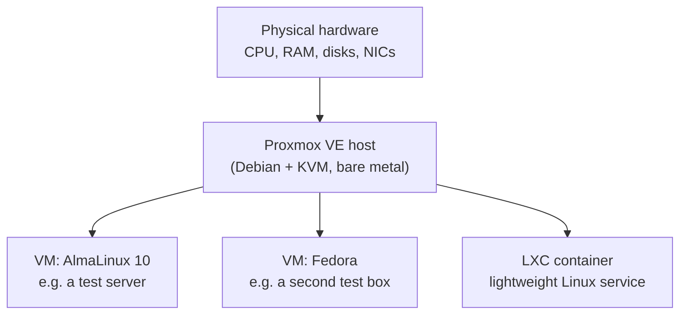

---
tags:
  - proxmox
  - virtualization
  - infrastructure
  - moc
aliases:
  - Proxmox
  - Proxmox VE
  - PVE
reading-order: 0
created: 2026-09-14
---

# 00 — What is Proxmox

> [!abstract] Why this note exists
> A reformat of a Windows box to **Fedora or AlmaLinux** was already scoped —
> that part is understood. The new, unfamiliar part is **"then set up
> Proxmox on it."** This note explains what Proxmox actually is, how it
> relates to the Linux install underneath it, and what the follow-up task
> is realistically going to look like, so the assignment isn't a surprise.
> Everything below is drawn from the **official Proxmox documentation and
> wiki** (linked throughout), not third-party blog guesses.

## The one-sentence version

**Proxmox VE (Virtual Environment)** is a free, open-source **virtualization
platform** — install it on bare metal and it turns that one physical
computer into a host that can run many independent virtual machines and
containers at once, each isolated from the others, managed through a web
browser. ([Proxmox VE overview](https://www.proxmox.com/en/proxmox-virtual-environment/overview))

Proxmox VE itself is built on **Debian Linux**. So "install Fedora or
AlmaLinux, then set up Proxmox" doesn't quite describe two separate layers
the way it might sound — in practice there are two common ways this plays
out, and it's worth clarifying which one the task actually means:

1. **Proxmox as the host** (the far more common setup): wipe the disk and
   install the **Proxmox VE installer ISO** directly — it lays down its own
   Debian base plus the hypervisor. Fedora/AlmaLinux then get created
   *inside* Proxmox as guest VMs.
2. **Proxmox on top of an existing Linux install**: Proxmox VE packages can
   also be added to a plain Debian install via `apt`, but this is not
   supported on Fedora or AlmaLinux (different package ecosystem — RPM vs
   Debian's APT), so this path doesn't apply to this hardware.

> [!tip] Most likely reading of the assignment
> "Reformat it to Fedora or AlmaLinux, then set up Proxmox" most likely
> means: **use the Proxmox VE installer as the actual host OS** (it replaces
> the need for a separate Fedora/AlmaLinux host install), and Fedora/AlmaLinux
> become the **guest virtual machines** created afterward. Confirm this
> interpretation with whoever assigns the task, but it's the standard way
> these two pieces fit together in the real world.

## Why virtualize at all

A **hypervisor** is software that lets one physical machine pretend to be
several. Proxmox is a **type-1 ("bare metal") hypervisor**: it runs directly
on the hardware rather than as an app inside another OS (that would be a
type-2 hypervisor, like VirtualBox on a Windows desktop). Running on bare
metal means each guest gets closer-to-native performance and stronger
isolation.

Practical reasons this matters for a vulnerability-management / infra
context specifically:
- **Disposable test environments** — spin up a VM, break it patching a CVE,
  snapshot/rollback or just delete it, with zero risk to anything else.
- **Isolated network segments** — practice segmentation, firewalling, or
  attack/patch scenarios without touching production.
- **One machine, many roles** — a single reformatted box can host several
  small Linux servers instead of needing separate physical hardware for each.

## Core building blocks

| Concept | What it means |
|---|---|
| **Node** | One physical (or virtual) Proxmox VE host. A single machine here = a single-node setup — no clustering needed. |
| **VM (KVM)** | A full virtual machine using Linux's built‑in **KVM** hypervisor — runs a complete guest OS (AlmaLinux, Fedora, Windows, anything) with its own virtual CPU, RAM, disk, and NIC. Strong isolation, more overhead. |
| **Container (LXC)** | A lightweight **Linux Container** — shares the host's kernel instead of virtualizing hardware. Starts faster, uses fewer resources, but guest OS must be Linux and isolation is weaker than a full VM. |
| **Storage** | Where VM/container disks, ISOs, and backups live — local disk, ZFS, LVM, NFS, Ceph, etc. Configured per-node in the **Datacenter → Storage** view. |
| **Bridge (`vmbr0`, …)** | A virtual network switch inside Proxmox that connects VMs/containers to each other and to the physical NIC — the default networking model for guests. |
| **Template** | A pre-built VM or container image marked read-only, used to quickly **clone** new guests instead of installing from ISO every time. |
| **Snapshot** | A saved point-in-time state of a VM/container disk (and optionally RAM) that you can revert to — invaluable for "try something risky, roll back if it breaks." |
| **Backup / restore (vzdump)** | Proxmox's built-in backup tool for VMs and containers, schedulable and restorable through the same web UI. |

([Proxmox VE Administration Guide — full reference for all of the above](https://pve.proxmox.com/pve-docs/pve-admin-guide.html))

## What the actual hands-on activity will probably look like

Based on how Proxmox is normally taught and used, the assignment is very
likely to involve some subset of:

1. **Installing the Proxmox VE ISO** onto the reformatted machine (the
   installer is graphical and fairly short — partitioning, root password,
   network/hostname, done).
2. **Reaching the web UI** — Proxmox is managed at `https://<node-ip>:8006`
   from another machine's browser once installed; there is no need to sit
   at the box itself after initial setup.
3. **Uploading or downloading an ISO** (e.g. AlmaLinux 10 or Fedora Server)
   into Proxmox's storage, then **creating a VM** from it — allocating
   virtual CPU cores, RAM, and disk size.
4. **Installing a guest OS inside that VM** — this is literally the same
   Fedora/AlmaLinux installer already familiar from bare-metal installs,
   just running inside a virtual machine window (via Proxmox's built-in
   noVNC console).
5. Possibly: **cloning a template**, **taking a snapshot**, or **setting up
   a second VM/container** to demonstrate multiple isolated guests running
   at once.
6. Possibly: basic **networking between VMs** (same bridge) or **backup/
   restore** of a VM, if the exercise goes past "just create one VM."

> [!info] What this is *not* likely to involve, at least initially
> Clustering multiple physical nodes together, Ceph distributed storage, or
> high-availability failover are all real Proxmox features but are
> multi-machine, production-scale concepts — unlikely to be the first
> assignment on a single reformatted box.

> [!tip] The actual build log
> Once the assignment was confirmed, everything that was actually built —
> the architecture, every technology choice and why, every bug hit and its
> fix — is tracked in [[OLIVERIO_AirNavDAS_SystemDiscoveryTask|System Discovery Task]].

## Licensing, in one paragraph

Proxmox VE is **fully open-source** (AGPLv3) — every feature (VMs,
containers, clustering, firewall, live migration) is available for free,
with no artificial feature-gating. Paying for a subscription buys access to
the vendor-tested **Enterprise repository** and official support, not extra
functionality. For a lab/study machine, the free **no-subscription
repository** is the normal choice and is what the installer sets up by
default. ([Proxmox VE — Subscription & support FAQ](https://www.proxmox.com/en/proxmox-virtual-environment/pricing))

## Minimum requirements (official)

Per the [official Proxmox VE System Requirements wiki page](https://pve.proxmox.com/wiki/System_Requirements):

- **CPU:** 64-bit x86 (Intel 64 / AMD64) with **Intel VT-x / AMD-V**
  virtualization support (needed for KVM), or 64-bit ARM.
- **RAM:** 1 GB minimum for evaluation, but that's *only* for the host
  itself — each guest VM needs its own RAM on top. 2 GB+ host overhead plus
  realistic per-VM allocations is the practical floor.
- **Storage:** at least ~32 GB for the install; more for actual VM disks.
  ZFS is a supported and commonly-used filesystem for VM storage, but
  Proxmox notes that **ZFS and Ceph should not be run behind a hardware RAID
  controller** — use either plain disks (for ZFS) or a proper hardware RAID
  with battery-backed cache, not both.
- **Network:** at least one NIC.

These are evaluation-level minimums, not production sizing — fine for a
learning/lab machine.

## Quick glossary

| Term | Meaning |
|---|---|
| **PVE** | Common shorthand for "Proxmox VE" |
| **KVM** | Kernel-based Virtual Machine — Linux's native full-virtualization hypervisor tech that Proxmox VMs run on |
| **LXC** | Linux Containers — the lightweight, kernel-sharing containerization tech Proxmox containers run on |
| **ISO** | A disk-image file of an installer (e.g. `AlmaLinux-10-x86_64-dvd.iso`) uploaded into Proxmox and attached to a VM as its virtual CD/DVD |
| **noVNC** | The browser-based remote console Proxmox uses to show a VM's screen without extra software |
| **vzdump** | Proxmox's backup utility for VMs/containers |

## Official sources used for this note

- [Proxmox VE overview](https://www.proxmox.com/en/proxmox-virtual-environment/overview) — what it is, feature list
- [Proxmox VE Administration Guide](https://pve.proxmox.com/pve-docs/pve-admin-guide.html) — the full official manual (VMs, containers, storage, networking, backup, clustering)
- [Installing Proxmox VE](https://pve.proxmox.com/pve-docs/chapter-pve-installation.html) — installer walkthrough
- [System Requirements — Proxmox VE Wiki](https://pve.proxmox.com/wiki/System_Requirements) — official hardware requirements
- [Proxmox VE pricing / subscription FAQ](https://www.proxmox.com/en/proxmox-virtual-environment/pricing) — licensing model
