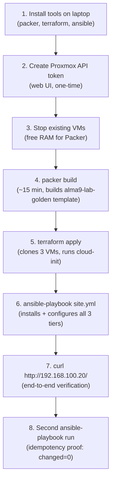

---
tags:
  - proxmox
  - packer
  - terraform
  - ansible
  - iac
  - automation
aliases:
  - Proxmox Automation
reading-order: 3
created: 2026-09-18
---

# 03 — Proxmox Automation: Packer + Terraform + Ansible

> [!abstract] What this document is
> A full assessment of the current system state (collected by SSHing into the Proxmox host on 2026-09-18), followed by the complete automation plan and runbook for rebuilding the three-tier lab (proxy → app → db) without touching a single GUI. This is the natural next step after [[OLIVERIO_AirNavDAS_SystemDiscoveryTask|the System Discovery Task]] and the Ansible sketch in [[02 — Stretch Goals#3 · Automate the build with Ansible|Stretch Goals §3]].

---

## 1 · System State Assessment

*SSH'd into `root@192.168.100.2` on 2026-09-18 to collect this data directly.*

### 1.1 — Proxmox Host

| Item | Value |
|---|---|
| **Hostname** | `pve` |
| **Proxmox Version** | `9.2.20 / pve-manager/9.2.20/49318c671b82f31e` |
| **Kernel** | `Linux 7.0.14-17-pve` |
| **Underlying OS** | Debian GNU/Linux 13 (trixie) |
| **Hardware** | ASUSTeK P8H67-M LE |
| **CPU** | Intel Core i5-2400 @ 3.10 GHz — 4 cores, 1 thread/core (**x86-64-v2 ceiling**) |
| **Total RAM** | **3.7 GiB** |
| **RAM in use** | ~3.2 GiB (3 VMs × 1536 MB each) |
| **RAM available** | ~540 MiB (with all 3 VMs running) |

> [!danger] RAM is the tightest constraint
> 3.7 GiB total, 3.2 GiB already consumed by the three running VMs. During the original manual build, the graphical Anaconda installer was memory-heavy enough that VMs had to be installed **one at a time**. Packer's `proxmox-iso` builder runs a temporary installer VM — this will compete for the same 540 MiB headroom. **Strategy: stop the existing VMs during the Packer build**, then bring them back up (or destroy and re-create them from the new template).

### 1.2 — Disk / Storage

| Pool | Type | Total | Used | Free |
|---|---|---|---|---|
| `local` (dir) | `/var/lib/vz` | 94 GiB | 8 GiB | 82 GiB ✅ |
| `local-lvm` (lvmthin) | LVM-thin | 323.5 GiB | ~11.5 GiB | ~312 GiB ✅ |

**ISOs present:** `AlmaLinux-9-latest-x86_64-minimal.iso` (2.7 GB) — already on the host. Packer can reference this directly instead of downloading it again.

**Existing VMs:**

| VMID | Name | Disk | RAM | Network | Status |
|---|---|---|---|---|---|
| 100 | db | `local-lvm` 15 GiB | 1536 MB | vmbr1 only | **running** |
| 101 | app | `local-lvm` 15 GiB | 1536 MB | vmbr1 only | **running** |
| 102 | proxy | `local-lvm` 15 GiB | 1536 MB | vmbr0 + vmbr1 | **running** |

**Snapshots on all three VMs:**
```
checkpoint            2026-09-14 10:27  (pre-chaos baseline)
  └─ itIsWednesdayMyDudes  2026-09-16 08:31  (current parent — Wednesday's work)
       └─ current          (live state)
```

> [!note] Snapshot strategy
> The existing snapshots are the safety net for the automation run. Before touching anything, take a fresh `pre-automation` snapshot on all three VMs:
> ```bash
> for vmid in 100 101 102; do qm snapshot $vmid pre-automation --description "Before IaC rebuild"; done
> ```

### 1.3 — VM Hardware Configuration

All three VMs share the same hardware profile (confirmed via `qm config`):

| Setting | Value | Why it matters |
|---|---|---|
| Machine type | `i440fx` (default, not q35) | SeaBIOS compatible — the combination confirmed working during the manual build |
| BIOS | `seabios` (default) | Not UEFI/OVMF — correct for this i5-2400 hardware |
| CPU type | `x86-64-v2-AES` | Correct — matches the hardware ceiling |
| Disk bus | `sata` | Not virtio-scsi — chosen deliberately during the manual build after boot failures |
| Network | `virtio` | Fine — virtio NIC works even with SeaBIOS |

> [!important] No cloud-init drive on any VM
> None of the manually-built VMs have a cloud-init `cdrom` drive attached. This is expected — they were configured by hand. The **new** VMs spun up by Terraform will use cloud-init for first-boot identity (hostname, SSH key injection, static IPs). The old VMs stay as-is.

### 1.4 — Tooling Inventory

| Tool | Proxmox host (`pve`) | Laptop (`aw16`) |
|---|---|---|
| `packer` | ❌ not installed | ❌ not installed |
| `terraform` | ❌ not installed | ❌ not installed |
| `ansible` | ❌ not installed | ❌ not installed |
| `ansible-galaxy` collections | — | — |
| Proxmox API token | ❌ **none created** | — |
| SSH key auth to VMs | ❌ Password-only | ✅ root@pve (key works) |

> [!warning] Everything needs to be installed on the laptop first
> All three tools run on the **control machine** (the laptop), not on Proxmox. Proxmox is the *target*. The one-time prerequisite before anything else is installing packer, terraform, and ansible on AlmaLinux 10.2.

### 1.5 — SSH Key Access

- `root@192.168.100.2` (Proxmox host): ✅ key auth working from laptop
- `root@10.10.10.10` (proxy), `root@10.10.10.11` (app), `root@10.10.10.12` (db): ❌ password-only

The internal VMs only accept password auth — confirmed when attempting `ssh -o BatchMode=yes` from the Proxmox host. This matters for the **existing** VMs; the **new** Terraform-deployed VMs will have SSH keys injected by cloud-init from birth, so Ansible can reach them without this problem.

---

## 2 · Architectural Decision: What to Automate

Given the assessment above, three options exist:

### Option A — Automate only the Ansible step (least work)
Keep the existing VMs (100/101/102), push SSH keys to them manually, then run an Ansible playbook against them. This is essentially the Stretch Goals §3 playbook, executed for real.

**Problem:** this doesn't actually automate the *provisioning* — the VM creation is still manual. It's Ansible-only, not the full Packer + Terraform + Ansible stack.

### Option B — Full IaC rebuild with new VMs (recommended ✅)
Destroy (or stop) the existing VMs, build a golden AlmaLinux 9 template with Packer, spin up three new VMs with Terraform (VMIDs 200/201/202), configure them with Ansible. The old VMs (100/101/102) can be kept as reference or destroyed.

**Why this is the right call:**
- It's the actual skill being learned — the full Packer → Terraform → Ansible pipeline as practiced in Pair A
- New VMs get cloud-init baked in from the template — SSH key auth, correct hostnames, and static IPs are wired in before the OS even boots for the first time
- Idempotent and repeatable — `terraform destroy && terraform apply` gives a clean slate in minutes
- The existing VMs serve as the baseline to compare against

### Option C — Template from existing VM, Terraform clones it
Use `qm template 100` to convert the existing DB VM into a template, clone from it with Terraform. Skips Packer entirely.

**Problem:** the existing VMs have no cloud-init. Clones would need manual network reconfiguration, defeating the purpose. Also, converting a running VM to a template destroys it.

**Decision: Option B.** Full pipeline. Keep existing VMs running (or snapshot + stop them) during the Packer build, then the new VMs replace them.

---

## 3 · Project Layout

```
~/proxmox-lab-iac/           ← all IaC for this lab lives here
├── packer/
│   ├── alma9-lab.pkr.hcl        # Packer build — proxmox-iso builder
│   ├── alma9-lab.auto.pkrvars.hcl  # Non-secret variables (gitignored for token)
│   └── kickstart/
│       └── ks.cfg               # Anaconda answer file
├── terraform/
│   ├── main.tf                  # VM resources (3 clones from template)
│   ├── variables.tf
│   ├── outputs.tf
│   └── cloud-init/
│       ├── proxy-user-data.yml  # cloud-config per VM
│       ├── app-user-data.yml
│       └── db-user-data.yml
├── ansible/
│   ├── ansible.cfg              # ProxyJump through 192.168.100.2
│   ├── inventory/
│   │   └── hosts.yml            # Written by Terraform output
│   ├── group_vars/
│   │   ├── all/
│   │   │   ├── vars.yml         # Plain variables
│   │   │   └── vault.yml        # Ansible Vault: DB password
│   │   ├── db.yml
│   │   ├── app.yml
│   │   └── proxy.yml
│   ├── roles/
│   │   ├── db/                  # MariaDB role
│   │   ├── app/                 # Flask role
│   │   └── proxy/               # Nginx + SELinux role
│   ├── templates/
│   │   ├── app.py.j2
│   │   ├── labapp.service.j2
│   │   └── labapp.conf.j2
│   └── site.yml
└── README.md
```

---

## 4 · Pre-Requisites: Tool Installation

All of these run on the **laptop (AlmaLinux 10.2)**, not on Proxmox.

### 4.1 — Install Packer

HashiCorp provides a repo for RHEL-family systems:

```bash
sudo dnf install -y dnf-plugins-core
sudo dnf config-manager --add-repo https://rpm.releases.hashicorp.com/RHEL/hashicorp.repo
sudo dnf install -y packer
packer version
```

### 4.2 — Install Terraform

Same HashiCorp repo (already added above):

```bash
sudo dnf install -y terraform
terraform version
```

### 4.3 — Install Ansible + required collections

```bash
sudo dnf install -y epel-release
sudo dnf install -y ansible
ansible --version

# Collections needed for this playbook:
ansible-galaxy collection install ansible.posix community.mysql community.general
```

### 4.4 — Create a Proxmox API Token (one-time, on the Proxmox web UI)

This is the one step that requires the browser. API tokens are safer than username/password — they can be revoked, scoped, and stored in a `.auto.tfvars` file that's gitignored.

1. Open `https://192.168.100.2:8006` → **Datacenter → API Tokens → Add**
2. User: `root@pam`, Token ID: `terraform`, **uncheck** "Privilege Separation" (so it inherits root's permissions)
3. Copy the secret immediately — it won't be shown again
4. Store it: create `~/proxmox-lab-iac/terraform/secret.auto.tfvars` (gitignored):
   ```hcl
   proxmox_api_token_secret = "PASTE-SECRET-HERE"
   ```

> [!caution] Keep the token secret out of git
> Add `secret.auto.tfvars` and `*.vault_pass` to `.gitignore` before the first commit. Same discipline as Pair A's `.vault_pass`.

---

## 5 · Stage 1 — Packer: Build the Golden Template

### 5.1 — How Packer talks to Proxmox

The `proxmox-iso` builder (not the `qemu` builder used in Pair A) connects to Proxmox over its REST API. Packer instructs Proxmox to:
1. Upload (or reference) the AlmaLinux 9 ISO already on `local`
2. Create a temporary VM, boot it from the ISO
3. Feed it a Kickstart via an attached ISO labelled `OEMDRV` (same OEMDRV trick from Pair A — no web server, no typed kernel args)
4. Wait for SSH to come up, run cleanup provisioners
5. Convert the VM to a **template** on `local-lvm`

### 5.2 — Key decisions baked into the template

| Decision | Value | Reason |
|---|---|---|
| Machine type | `pc` (i440fx) | SeaBIOS compatible, confirmed working in manual build |
| BIOS | `seabios` | This hardware's proven combination |
| Disk bus | `sata` | Matches the manually-built VMs that work |
| CPU | `x86-64-v2` | Hardware ceiling — i5-2400 cannot run v3 |
| cloud-init drive | **included** | Template pre-wired for cloud-init; enables per-VM identity at clone time |
| SSH user for Packer | `root` (temporary) | Packer needs SSH access post-install; removed/locked in provisioner |

### 5.3 — Kickstart design

Simpler than Pair A's (no LVM, no CIS partition layout — this is a lab, not a compliance target):

```
# Partition layout — simple, no LVM
clearpart --all --initlabel
part /boot --fstype=xfs --size=1024
part / --fstype=xfs --size=1 --grow
part swap --size=2048

# Package set — minimal + cloud-init
%packages
@^minimal-environment
cloud-init
cloud-utils-growpart
python3
openssh-server
%end

# Post-install: enable cloud-init, disable root password login
%post
systemctl enable cloud-init cloud-init-local cloud-config cloud-final
sed -i 's/^#PermitRootLogin.*/PermitRootLogin prohibit-password/' /etc/ssh/sshd_config
%end
```

> [!note] Root password for Packer vs. Ansible
> Packer needs to SSH in as root to run cleanup. The Kickstart sets a temporary root password that Packer uses. After the template is built, Terraform clones it and cloud-init replaces root access with an `ansible` user + SSH key. The root password in the template doesn't matter for the final VMs.

### 5.4 — RAM strategy during the Packer build

The host has ~540 MiB free with all 3 VMs running. The Packer installer VM needs at least 1 GiB. **Options:**
- **Preferred:** stop the existing VMs before the Packer run (`qm stop 100 101 102`), build the template (~15 min), then either start the old ones back or destroy them once the new ones are ready.
- **Alternative:** reduce the Packer builder VM's RAM to 1024 MB (the Anaconda text installer uses less RAM than the graphical one — Kickstart forces text mode, so this should be fine).

### 5.5 — The Packer run

```bash
cd ~/proxmox-lab-iac/packer
packer init .
packer validate alma9-lab.pkr.hcl
packer build alma9-lab.pkr.hcl
```

Expected output: a template named `alma9-lab-golden` visible in the Proxmox UI under `local-lvm`.

---

## 6 · Stage 2 — Terraform: Clone Three VMs

### 6.1 — Provider

The `bpg/proxmox` provider (not `dmacvicar/libvirt` from Pair A). It speaks directly to the Proxmox REST API — no libvirt daemon needed.

```hcl
terraform {
  required_providers {
    proxmox = {
      source  = "bpg/proxmox"
      version = "~> 0.66"
    }
  }
}

provider "proxmox" {
  endpoint  = "https://192.168.100.2:8006/"
  api_token = "root@pam!terraform=${var.proxmox_api_token_secret}"
  insecure  = true   # self-signed cert on this host
}
```

### 6.2 — What Terraform creates

For each VM (proxy / app / db):

1. **A clone** of `alma9-lab-golden` — Proxmox's linked-clone mechanism, same copy-on-write principle as Pair A's `base_volume_id`
2. **A cloud-init drive** — attached as a separate CDROM disk, labelled `cidata` — cloud-init finds it by label, not by device path
3. **Network interfaces** — static IPs assigned via cloud-init `network_config`, matching the manual build's IP plan

### 6.3 — IP plan (unchanged from manual build)

| VM | Name | Network | Address |
|---|---|---|---|
| VMID 200 | proxy | vmbr0 + vmbr1 | `192.168.100.20/24` (ext) + `10.10.10.10/24` (int) |
| VMID 201 | app | vmbr1 only | `10.10.10.11/24` |
| VMID 202 | db | vmbr1 only | `10.10.10.12/24` |

> [!note] Why 200/201/202 and not 100/101/102
> Using a separate ID range avoids collision with the existing manually-built VMs. Once the new set is verified working end-to-end, the old VMs (100/101/102) can be archived (snapshot + stop) or destroyed.

### 6.4 — cloud-init per VM

cloud-init handles the things that make each clone unique:

```yaml
#cloud-config
hostname: proxy          # different per VM
fqdn: proxy.lab.local

users:
  - name: ansible
    groups: wheel
    sudo: ALL=(ALL) NOPASSWD:ALL
    lock_passwd: true
    ssh_authorized_keys:
      - ssh-ed25519 AAAA...    # laptop's public key

ssh_pwauth: false

# Network config injected separately by Terraform's network_config block
```

### 6.5 — Inventory output

Terraform writes `ansible/inventory/hosts.yml` using `templatefile()` — same pattern as Pair A. Once `terraform apply` completes, Ansible has a ready inventory without any manual editing.

### 6.6 — The Terraform run

```bash
cd ~/proxmox-lab-iac/terraform
terraform init
terraform validate
terraform plan
terraform apply
```

Expected: 3 VMs appear in Proxmox UI, each booting, cloud-init running on first boot (sets hostname, creates `ansible` user, configures network), SSH available within ~90 seconds.

---

## 7 · Stage 3 — Ansible: Configure the Three Tiers

### 7.1 — ansible.cfg

Same ProxyJump pattern as the Stretch Goals §3, but using the `ansible` user (not root) — cloud-init already set up the key and sudo:

```ini
[defaults]
inventory         = inventory/hosts.yml
remote_user       = ansible
host_key_checking = False

[ssh_connection]
ssh_args = -o ProxyCommand="ssh -W %h:%p root@192.168.100.2" -o ControlMaster=auto -o ControlPersist=60s
```

> [!note] ProxyJump through Proxmox
> The app and db VMs are on `vmbr1` only — no route from the laptop directly. Same situation as the manual build's `ssh -J` pattern. `ansible.cfg` wires this permanently so every `ansible-playbook` run uses it automatically.

### 7.2 — Role structure

Refactored from the flat `site.yml` in Stretch Goals §3 into proper roles:

| Role | What it does |
|---|---|
| `db` | dnf mariadb-server → enable → create labdb + labuser (from vault) → seed greetings table → firewalld port 3306 |
| `app` | dnf python3 → pip flask + pymysql → deploy app.py (j2 template with DB creds from vault) → systemd labapp.service → firewalld port 5000 |
| `proxy` | dnf nginx → deploy labapp.conf (j2 template with app IP) → enable nginx → firewalld http → SELinux `httpd_can_network_connect` boolean |

### 7.3 — Ansible Vault for the DB password

The DB password (`labpass123` in the manual build, or something stronger) lives in `group_vars/all/vault.yml`, encrypted with Ansible Vault:

```bash
ansible-vault create ansible/group_vars/all/vault.yml
```

Contents:
```yaml
vault_db_password: "labpass123"
```

Referenced in `vars.yml` (plain, committed):
```yaml
db_password: "{{ vault_db_password }}"
```

Used in `app.py.j2`:
```python
conn = pymysql.connect(
    host="10.10.10.12", user="labuser",
    password="{{ db_password }}", database="labdb"
)
```

### 7.4 — The Ansible run

```bash
cd ~/proxmox-lab-iac/ansible

# Confirm connectivity first
ansible all -m ping

# Dry run
ansible-playbook site.yml --vault-password-file ~/.vault_pass --check --diff

# For real
ansible-playbook site.yml --vault-password-file ~/.vault_pass
```

### 7.5 — Idempotency check

```bash
# Run it a second time immediately after
ansible-playbook site.yml --vault-password-file ~/.vault_pass
# Every task should show 'ok', changed=0 on all hosts
```

---

## 8 · Verification

Same three-hop trace as [[OLIVERIO_AirNavDAS_SystemDiscoveryTask#7 · Part Five — Proving it: tracing one request across every hop|§7 of the main task]], but now the whole stack was built by code:

```bash
# Tab 1 — proxy log
ssh -J root@192.168.100.2 ansible@10.10.10.10 "sudo tail -f /var/log/nginx/access.log"

# Tab 2 — app log
ssh -J root@192.168.100.2 ansible@10.10.10.11 "sudo journalctl -u labapp -f"

# Tab 3 — DB log
ssh -J root@192.168.100.2 ansible@10.10.10.12 "sudo journalctl -u mariadb -f"

# Tab 4 — fire the request
curl -v http://192.168.100.20/
```

Expected: `HTTP/1.1 200 OK`, `<h1>Hello from the App VM</h1><p>DB says: Hello from the DB VM!</p>`

**All three logs light up in the same second. That's the proof.**

---

## 9 · What's Different from the Manual Build

| Aspect | Manual (OLIVERIO_AirNavDAS_SystemDiscoveryTask) | Automated (this) |
|---|---|---|
| OS install | Anaconda GUI × 3 (~20 min each) | Packer + Kickstart × 1 → 2 clones (~15 min total) |
| VM creation | Proxmox web UI, one at a time | `terraform apply` |
| Network config | `nmcli` typed by hand | cloud-init, injected before first boot |
| SSH user | `root` direct | `ansible` (least privilege, key-only) |
| Service config | SSH + bash commands, 3 separate sessions | `ansible-playbook site.yml`, one run |
| DB password | Plaintext in terminal history | Ansible Vault (AES256) |
| Idempotency | None | Re-run Ansible any time; `changed=0` on a converged system |
| Rebuild time | ~2–3 hours | ~15 min (after golden template exists) |
| Reproducibility | Relies on memory/notes | Exact same result every time from code |

> [!tip] The point
> The manual build was the right way to learn *what each piece does*. This IaC pipeline is what you reach for the second time — after a rebuild, across multiple environments, or when you want to prove that two machines are configured identically rather than trusting that you typed the same commands twice.

---

## 10 · Execution Order



---

## 11 · Open Issues / Next Steps

- [ ] Install `packer`, `terraform`, `ansible` on the laptop
- [ ] Create the Proxmox API token (`root@pam!terraform`)
- [ ] Write all the IaC files (packer HCL + kickstart, terraform HCL, ansible roles)
- [ ] Decide: destroy VMs 100/101/102 after automation is verified, or keep as reference
- [ ] Optional: wire up a `Jenkinsfile` like Pair A for fully automated reruns

