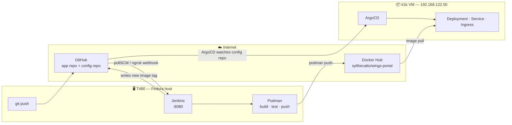

# CI/CD Master Guide

> [!abstract] What this is
> A build-it-yourself pipeline that runs **entirely on your laptop** — no
> company network, no shared registry. You write an app, containerise it with
> **Podman**, let **Jenkins** test and publish it to **Docker Hub**, and let
> **ArgoCD** pull it into a **k3s** cluster running in a local VM.
>
> Every command here was run on this machine before it was written down.



---

## Map of Content

| # | Section | What you get |
|---|---|---|
| — | [[#The one idea that makes this click]] | Why two repos, why Jenkins never runs `kubectl` |
| 1 | [[#Part 1 — Host prep]] | Podman, Jenkins, ngrok, Docker Hub account |
| 2 | [[#Part 2 — Podman first, no CI]] | Build and run the image by hand |
| 3 | [[#Part 3 — The CI pipeline]] | Jenkins multibranch, credentials, webhook |
| 4 | [[#Part 4 — The k3s VM]] | `virt-install`, cloud-init, kubeconfig |
| 5 | [[#Part 5 — ArgoCD and the deploy]] | Install, Applications, first sync |
| 6 | [[#Part 6 — Prove the whole loop]] | One commit → browser shows new version |

**Deep dives** — read these when a section above raises a question:
[[01 — Podman]] · [[02 — Jenkins]] · [[03 — Kubernetes]] · [[04 — ArgoCD]] · [[05 — Troubleshooting]]

**Repos on disk** — both already built and committed:
`~/Documents/wings-portal` (app + CI) · `~/Documents/wings-portal-config` (manifests)

---

## The one idea that makes this click

Most people's first pipeline ends with `kubectl apply` inside Jenkins. That
works, and it is the thing you will be asked to stop doing.

> [!question]- Why not just `kubectl apply` from Jenkins?
> Because then **the cluster's desired state lives in a Jenkins job**. Ask
> "what is running in production right now and who put it there?" and the only
> honest answer is "whatever the last successful build did." You cannot diff it,
> cannot review it, cannot roll it back without re-running a build, and Jenkins
> needs permanent cluster-admin credentials.

The split:

|                     | **CI** — Jenkins                                           | **CD** — ArgoCD                         |
| ------------------- | ---------------------------------------------------------- | --------------------------------------- |
| Trigger             | you push app code                                          | config repo changes                     |
| Job                 | test → build → push image → **write the new tag into git** | notice git changed → make cluster match |
| Talks to            | Docker Hub, GitHub                                         | the cluster only                        |
| Needs cluster creds | **no**                                                     | yes                                     |
| Repo                | `wings-portal`                                             | `wings-portal-config`                   |

Jenkins' last act is a **git commit**, not a deploy. ArgoCD does the deploying,
and its input is a reviewable diff.

> [!danger] Two repos, not one — this is not style
> ArgoCD's directory source parses **every file** in the path you point it at as
> a Kubernetes manifest. Point it at an app repo and it reaches
> `requirements.txt`, finds no `kind:`, and fails the entire comparison:
> `ComparisonError` → `Sync: Unknown` → nothing deploys and the error names a
> file that has nothing to do with Kubernetes. Keep manifests in their own repo.

---

# Part 1 — Host prep

## 1.1 Podman

Already installed here (5.8.4). Confirm rootless works:

```bash
podman --version
podman info --format '{{.Host.Security.Rootless}}'   # must print: true
podman run --rm quay.io/podman/hello
```

> [!info] Rootless is the default and it is the point
> Podman has no daemon. `podman build` runs as **you**, in your user namespace,
> and a container breakout lands on your uid — not root. Docker's daemon runs as
> root and membership in the `docker` group is effectively passwordless root on
> the host. This is the main reason RHEL shops standardised on Podman.

## 1.2 Jenkins

```bash
sudo systemctl enable --now jenkins
sudo systemctl status jenkins --no-pager
xdg-open http://127.0.0.1:8080
```

First unlock:

```bash
sudo cat /var/lib/jenkins/secrets/initialAdminPassword
```

> [!warning] Jenkins runs as the `jenkins` user, not you
> `podman build` inside a job runs as `jenkins`, which needs its own rootless
> setup. Do this once — the pipeline fails in a confusing way without it:
> ```bash
> # subuid/subgid ranges: required for rootless user namespaces
> sudo usermod --add-subuids 200000-265535 --add-subgids 200000-265535 jenkins
> # linger: keeps the user's systemd session (and XDG_RUNTIME_DIR) alive
> # without an interactive login, which is exactly Jenkins' situation
> sudo loginctl enable-linger jenkins
> sudo -u jenkins env XDG_RUNTIME_DIR=/run/user/$(id -u jenkins) podman info >/dev/null && echo OK
> ```

## 1.3 Docker Hub

You have no local registry, so Docker Hub is the artifact store.

1. Create the account / log in at hub.docker.com.
2. **Account Settings → Personal access tokens → Generate** — scope
   *Read, Write, Delete*. Copy it once.
3. Test from the CLI:

```bash
podman login docker.io -u sylthecatto        # paste the TOKEN, not your password
```

> [!tip] Use a token, never your account password
> A token is scoped, revocable, and does not unlock the web account. In Jenkins
> it goes in a **Username/password** credential where the *password* field holds
> the token — see [[02 — Jenkins#Credentials]].
>
> You do **not** need Docker Desktop. Podman pushes to Docker Hub natively;
> `docker.io/<user>/<image>` is just a registry URL.

## 1.4 ngrok — only for real webhooks

Jenkins is on `127.0.0.1:8080`. GitHub cannot reach that. Two options:

| | `pollSCM` | ngrok webhook |
|---|---|---|
| Setup | one line in the Jenkinsfile | tunnel + GitHub config |
| Latency | up to 5 min | instant |
| Needs internet exposure | no | yes |
| Good for | daily lab work | practising the real thing |

The Jenkinsfile already has `pollSCM('H/5 * * * *')`, so **you can skip this and
still complete the whole guide.** Set ngrok up when you want the real trigger:

```bash
sudo dnf install -y ngrok || {
  curl -sSL https://bin.equinox.io/c/bNyj1mQVY4c/ngrok-v3-stable-linux-amd64.tgz \
    | sudo tar xz -C /usr/local/bin
}
ngrok config add-authtoken 3H46BssKoY5vMFzrVuMQf0GjrlW_7LpgvBDjKkVWJTESEi5wK
ngrok http 8080

Live credential in plaintext — revoke this
This token was stored unencrypted in the vault. Revoke it at
https://github.com/settings/tokens, then authenticate with
gh auth login or a git credential helper instead of a pasted PAT.
Delete this file once the token is dead.

```

Take the `https://xxxx.ngrok-free.app` URL, then in the GitHub repo →
**Settings → Webhooks → Add webhook**:

- Payload URL: `https://xxxx.ngrok-free.app/github-webhook/` — **the trailing slash matters**
- Content type: `application/json`
- Events: *Just the push event*

> [!warning] The free tunnel URL changes every restart
> You must update the GitHub webhook each time. Also set
> **Manage Jenkins → System → Jenkins URL** to the ngrok URL, or the links in
> build emails and the GitHub status API point at `localhost`.

---

# Part 2 — Podman first, no CI

Do this by hand before automating it. A pipeline that wraps a build you have
never run manually is a pipeline you cannot debug.

```bash
cd ~/Documents/wings-portal
```

## 2.1 Read the Containerfile

`Containerfile` is byte-for-byte a `Dockerfile` — same instruction set, same
syntax. The name is the vendor-neutral one; Podman reads either, and prefers
`Containerfile` when both exist. Full annotated breakdown: [[01 — Podman#The Containerfile line by line]].

The three decisions that matter:

> [!example]- Multi-stage: why the compiler never ships
> ```dockerfile
> FROM python:3.12-slim AS builder     # has pip, gcc, headers
> RUN python -m venv /opt/venv && /opt/venv/bin/pip install -r requirements.txt
>
> FROM python:3.12-slim AS runtime     # clean base
> COPY --from=builder /opt/venv /opt/venv
> ```
> Only `/opt/venv` crosses the boundary. Build tools, pip's cache and every
> intermediate layer are discarded — smaller image, smaller attack surface.

> [!example]- Layer order: why `requirements.txt` is copied alone
> ```dockerfile
> COPY requirements.txt .              # ← cache key = this file only
> RUN pip install -r requirements.txt  # ← re-runs ONLY when deps change
> COPY app/ ./app/                     # ← app edits invalidate from here down
> ```
> Copy the whole source first and every one-character code change re-installs
> every dependency. This is the single most common Containerfile mistake.

> [!example]- `CMD` exec form: why the brackets are not cosmetic
> ```dockerfile
> CMD ["gunicorn", "--bind", "0.0.0.0:8080", "app.main:app"]   # ✅ PID 1 = gunicorn
> CMD gunicorn --bind 0.0.0.0:8080 app.main:app                # ❌ PID 1 = /bin/sh
> ```
> Shell form wraps the process in `/bin/sh`, which does not forward `SIGTERM`.
> The container then ignores `podman stop` and Kubernetes' graceful shutdown,
> and gets `SIGKILL`ed after the grace period — every deploy drops connections.

## 2.2 Build

The repo ships a `Makefile` that carries the flags you cannot afford to forget.
Jenkins runs the same targets, so local and CI cannot drift apart:

```bash
make test        # pytest
make build       # podman build --format docker + build args
make verify      # assert HEALTHCHECK present and image is non-root
make run         # run, then poll until healthy
```

<details><summary>The raw build command it wraps</summary>

```bash
podman build --format docker \
  --build-arg APP_VERSION=1.0.0 \
  --build-arg GIT_SHA=$(git rev-parse --short HEAD) \
  -t wings-portal:1.0.0 -f Containerfile .
```
</details>

> [!bug] `--format docker`, and why a guard beats remembering it
> Podman defaults to the **OCI** format, which has no `HEALTHCHECK` instruction.
> Omit the flag and Podman prints
> `HEALTHCHECK is not supported for OCI image format and will be ignored`
> — a **warning**. The build goes green and you ship an image with no
> healthcheck.
>
> A flag you must remember is not a fix. `make verify` inspects the built image
> and **fails** if the healthcheck is missing:
> ```
> FAIL: image has no HEALTHCHECK.
>       Podman defaults to OCI format, which silently DROPS it.
>       Rebuild with: podman build --format docker ...
> ```
> Verified by deliberately building without the flag.

## 2.3 Run and verify

```bash
podman run -d --name wp -p 8888:8080 -e APP_ENV=staging wings-portal:1.0.0
curl -s http://127.0.0.1:8888/api/info | python3 -m json.tool
podman exec wp id            # uid=1001(appuser) — NOT root
podman logs wp
podman rm -f wp
```

> [!bug] Use `127.0.0.1`, never `localhost` — and this one has no fix
> ```
> $ curl http://localhost:8888/health
> curl: (56) Recv failure: Connection reset by peer
> $ curl http://127.0.0.1:8888/health
> {"status":"healthy"}
> ```
> Rootless Podman's `pasta` backend forwards **IPv4 only**, and `localhost`
> resolves to `::1` first. Both workarounds were tested on this laptop and
> **neither works**:
>
> | Attempt | Result |
> |---|---|
> | `-p '[::1]:8888:8080'` as well | socket listens on `[::1]`, pasta still won't forward — `curl -6` fails |
> | `--network slirp4netns` | worse: both IPv4 and IPv6 fail |
>
> So treat it as environmental, not a bug to solve. Bind and curl `127.0.0.1`
> **explicitly** — `-p 127.0.0.1:8888:8080` — so the intent is in the command
> rather than in someone's memory. `make run` does this and prints the right URL.

## 2.4 Push by hand once

```bash
podman login docker.io -u sylthecatto
podman tag  wings-portal:1.0.0 docker.io/sylthecatto/wings-portal:1.0.0
podman push docker.io/sylthecatto/wings-portal:1.0.0
```

Once that works from your shell, Jenkins doing it is a formality.

---

# Part 3 — The CI pipeline

## 3.1 Push both repos to GitHub

```bash
cd ~/Documents/wings-portal
git remote add origin https://github.com/sylthecatto/wings-portal.git
git push -u origin main
git checkout -b staging && git push -u origin staging
git checkout -b production && git push -u origin production

cd ~/Documents/wings-portal-config
git remote add origin https://github.com/sylthecatto/wings-portal-config.git
git push -u origin main
```

> [!tip] Branch → tag → environment
> | Branch | Image tag | Namespace | Why |
> |---|---|---|---|
> | `staging` | `staging-<sha>` | `wings-staging` | one throwaway tag per commit, traceable to source |
> | `production` | `v1.0.<build>` | `wings-prod` | semantic, promoted deliberately |
>
> Never deploy `:latest`. A tag that moves makes rollback meaningless and hides
> drift from ArgoCD.

## 3.2 Credentials

**Manage Jenkins → Credentials → System → Global → Add**, twice:

| ID | Kind | Username | Password |
|---|---|---|---|
| `dockerhub-creds` | Username/password | `sylthecatto` | Docker Hub **token** |
| `github-creds` | Username/password | `sylthecatto` | GitHub **PAT** (`repo` scope) |

The IDs must match the Jenkinsfile exactly. Full explanation of why a *file*
credential is used for vault passwords but username/password here:
[[02 — Jenkins#Credentials]].

> [!danger] Rotate the PAT sitting in your vault
> `AIRNAV WINGS Cadet/04 — Program/SECRET — GitHub PAT (REVOKE ME).md` holds a
> live token in plaintext. Revoke it and mint a fresh one for `github-creds`.

## 3.3 The multibranch pipeline

**New Item → `wings-portal` → Multibranch Pipeline**

| Field | Value |
|---|---|
| Branch Sources | Git → `https://github.com/sylthecatto/wings-portal.git` |
| Credentials | `github-creds` |
| Behaviours | Discover branches |
| Build Configuration | by Jenkinsfile → `Jenkinsfile` |
| Scan Triggers | ✅ Periodically if not otherwise run → **1 minute** |

Save. Jenkins scans and creates one sub-job per branch automatically.

> [!warning] The first build must be manual
> `triggers { pollSCM(...) }` lives *inside* the Jenkinsfile. Jenkins cannot
> know a trigger exists until it has read that file, which only happens during
> a build. **Run one build by hand**, then polling arms itself. This trips up
> everyone once.

## 3.4 What each stage is for

| Stage | Proves |
|---|---|
| Checkout | resolves the short SHA and picks the tag scheme from the branch |
| **Test** | source is correct — *before* any image exists to push |
| Build image | the Containerfile is valid and build args land |
| **Verify image** | the built image really has a `HEALTHCHECK` and really is non-root — catches the silent OCI-format drop |
| **Smoke test** | the **image** actually runs: catches a bad `CMD`, missing runtime dep, wrong `WORKDIR` — none of which pytest can see |
| Push | artifact reaches Docker Hub |
| **Update config repo** | writes `newTag:` into the config repo and commits — **this is the CI/CD boundary** |

> [!important]- Verify vs Smoke — they catch different things
> **Verify** inspects image *metadata* without running it: is the healthcheck
> there, is `USER` non-root. **Smoke** actually starts the container and curls
> it. An image can pass one and fail the other, which is why both exist.

> [!note]- Why Test runs before Build
> A failing test must never produce a pushed artifact. Ordering is the
> enforcement — there is no other gate.

> [!note]- Why the smoke test polls instead of `sleep 5`
> ```bash
> for i in $(seq 1 30); do
>   curl -sf http://127.0.0.1:18080/health && break
>   [ "$i" = "30" ] && { podman logs smoke-${BUILD_NUMBER}; exit 1; }
>   sleep 1
> done
> ```
> A fixed sleep is either wasted time on a fast machine or a flake on a slow
> one. Note it dumps container logs before failing — otherwise you get a red
> build with no evidence.

---

# Part 4 — The k3s VM

Full k8s is heavy. **k3s** is a certified-conformant single binary that runs the
whole control plane in ~512 MB, with Traefik as the ingress controller already
bundled.

## 4.1 Create the VM

```bash
# AlmaLinux 9 cloud image — matches the RHEL family used at work
cd /var/lib/libvirt/images
sudo curl -LO https://repo.almalinux.org/almalinux/9/cloud/x86_64/images/AlmaLinux-9-GenericCloud-latest.x86_64.qcow2

sudo virt-install \
  --name k3s \
  --memory 4096 --vcpus 2 \
  --disk path=/var/lib/libvirt/images/k3s.qcow2,size=20,backing_store=/var/lib/libvirt/images/AlmaLinux-9-GenericCloud-latest.x86_64.qcow2 \
  --os-variant almalinux9 \
  --network network=default \
  --cloud-init user-data=/tmp/k3s-user-data.yaml \
  --graphics none --noautoconsole --import
```

`/tmp/k3s-user-data.yaml`:

```yaml
#cloud-config
users:
  - name: hans
    sudo: ALL=(ALL) NOPASSWD:ALL
    groups: wheel
    shell: /bin/bash
    ssh_authorized_keys:
      - ssh-ed25519 AAAA...   # paste: cat ~/.ssh/id_ed25519.pub
package_update: true
```

Pin the IP so it survives reboots, then find it:

```bash
virsh -c qemu:///system net-update default add ip-dhcp-host \
  "<host mac='52:54:00:xx:xx:xx' name='k3s' ip='192.168.122.50'/>" --live --config
virsh -c qemu:///system domifaddr k3s
```

## 4.2 Install k3s

```bash
ssh hans@192.168.122.50
curl -sfL https://get.k3s.io | sh -
sudo systemctl status k3s --no-pager
sudo k3s kubectl get nodes        # Ready
```

## 4.3 Get the kubeconfig onto the host

```bash
ssh hans@192.168.122.50 'sudo cat /etc/rancher/k3s/k3s.yaml' > ~/.kube/config
# the file says 127.0.0.1, which from your laptop means your laptop
sed -i 's|127.0.0.1|192.168.122.50|' ~/.kube/config
chmod 600 ~/.kube/config
kubectl get nodes -o wide
```

> [!success] Docker Hub means no registry pain
> Because images live on Docker Hub over HTTPS, you skip the
> `/etc/rancher/k3s/registries.yaml` insecure-registry dance entirely. If you
> ever *do* run a local HTTP registry, that config — and why editing the
> generated `certs.d` file does nothing — is in
> [[05 — Troubleshooting#Registry and image pull]].

---

# Part 5 — ArgoCD and the deploy

## 5.1 Install

```bash
kubectl create namespace argocd
kubectl apply -n argocd -f https://raw.githubusercontent.com/argoproj/argo-cd/stable/manifests/install.yaml
kubectl -n argocd rollout status deploy/argocd-server --timeout=300s
```

## 5.2 Get in

```bash
kubectl -n argocd get secret argocd-initial-admin-secret \
  -o jsonpath='{.data.password}' | base64 -d; echo
kubectl -n argocd port-forward svc/argocd-server 8081:443
# https://127.0.0.1:8081  — user: admin
```

## 5.3 Register the Applications

```bash
cd ~/Documents/wings-portal-config
kubectl apply -f argocd/app-staging.yaml
kubectl apply -f argocd/app-production.yaml
kubectl -n argocd get applications
```

Both are `automated` with `prune` and `selfHeal`:

| Option | Effect | The surprise it causes |
|---|---|---|
| `prune: true` | deletes cluster objects removed from git | — |
| `selfHeal: true` | reverts manual live edits | your `kubectl edit` undoes itself in ~30s |
| `CreateNamespace=true` | creates the target namespace | without it: `namespaces "wings-staging" not found` |

> [!tip] Render before you push
> ```bash
> kubectl kustomize overlays/staging
> kubectl kustomize overlays/production
> ```
> Catches a bad patch locally instead of as a red Application in the UI.

---

# Part 6 — Prove the whole loop

Change one visible thing and follow it all the way to the browser.

```bash
cd ~/Documents/wings-portal
git checkout staging
sed -i 's|<h1>WINGS Portal</h1>|<h1>WINGS Portal ✦</h1>|' app/templates/index.html
git commit -am "feat: mark the page so the deploy is visible"
git push
```

Then watch each hop:

```bash
# 1. Jenkins picked it up (or click Build Now)
#    -> Test, Build, Smoke, Push, Update config repo

# 2. the tag landed in git
cd ~/Documents/wings-portal-config && git pull
grep -A2 '^images:' overlays/staging/kustomization.yaml

# 3. Docker Hub has the artifact
podman search --list-tags docker.io/sylthecatto/wings-portal

# 4. ArgoCD synced
kubectl -n argocd get app wings-portal-staging \
  -o custom-columns=SYNC:.status.sync.status,HEALTH:.status.health.status

# 5. the cluster rolled
kubectl -n wings-staging get pods -w

# 6. the browser agrees
curl -s http://staging.192.168.122.50.nip.io/api/info | python3 -m json.tool
```

> [!success] Done when
> - `kubectl -n wings-staging get pods` → Running, **0 restarts**, stable
> - `kubectl -n wings-staging get endpoints` → has addresses (not `<none>`)
> - ArgoCD shows **Synced + Healthy**
> - `/api/info` reports the commit you just pushed
> - the page shows `✦`

---

## Where to go next

| You want to | Read |
|---|---|
| Understand every Containerfile line, pods, volumes, `podman generate systemd` | [[01 — Podman]] |
| Declarative vs scripted, shared libraries, agents, credential types | [[02 — Jenkins]] |
| Probes, Services, Ingress, resources, the objects and how they relate | [[03 — Kubernetes]] |
| Sync waves, hooks, rollback, app-of-apps, drift | [[04 — ArgoCD]] |
| **Something is broken** | [[05 — Troubleshooting]] |

> [!quote] The habit worth keeping
> Diagnose **outside-in along the request path**, and collect *every* fault
> before fixing any of them — they mask each other. Pods → describe → logs →
> endpoints → service → ingress → registry → ArgoCD.
