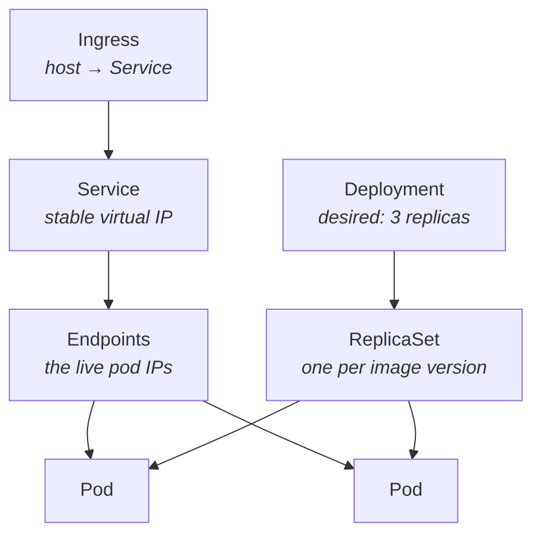

# Kubernetes

> [!abstract] A control loop over declared state
> You submit an object saying *what you want*. A controller compares that to
> *what exists* and acts to close the gap — continuously, forever. Nothing in
> Kubernetes is "run once"; everything is reconciliation.



> [!important] Endpoints is where the two halves meet
> The Service finds pods **by label**, not by name or by owner. A Service whose
> `selector` does not match the pods' labels has an empty `Endpoints` list and
> silently blackholes every request — while `kubectl get pods` shows everything
> Running. Check `Endpoints` first, always.

---

## The objects that matter here

| Object | One line | Fails as |
|---|---|---|
| **Pod** | one or more containers sharing an IP | `CrashLoopBackOff`, `ImagePullBackOff` |
| **ReplicaSet** | keeps N pods alive | rarely touched directly |
| **Deployment** | manages ReplicaSets → rollouts and rollbacks | stuck rollout |
| **Service** | stable IP + DNS for a changing set of pods | `Endpoints: <none>` |
| **Ingress** | HTTP host/path → Service | silent 404 |
| **ConfigMap / Secret** | config and credentials, injected as env or files | pod stuck `CreateContainerConfigError` |
| **Namespace** | scope boundary | `namespaces "x" not found` |

---

## Deployment, annotated

From `~/Documents/wings-portal-config/base/deployment.yaml`.

```yaml
spec:
  replicas: 2
  selector:
    matchLabels: { app: wings-portal }   # ← must match template.metadata.labels
  template:
    metadata:
      labels: { app: wings-portal }      # ← and the Service's selector
```

> [!warning] Three labels must agree
> `Deployment.spec.selector.matchLabels` = `template.metadata.labels` =
> `Service.spec.selector`. `spec.selector` is **immutable** after creation —
> getting it wrong means deleting and recreating the Deployment.

### Probes

```yaml
livenessProbe:
  httpGet: { path: /health, port: http }
  initialDelaySeconds: 10
  periodSeconds: 15
  failureThreshold: 3
readinessProbe:
  httpGet: { path: /ready, port: http }
  initialDelaySeconds: 3
```

| | Liveness | Readiness |
|---|---|---|
| Question | is this process wedged? | should it get traffic? |
| On failure | **restarts the container** | removes it from Endpoints, **no restart** |
| Should check | only itself | its dependencies too |

> [!danger] Never check a dependency in a liveness probe
> If liveness hits the database and the database has a blip, Kubernetes restarts
> every healthy pod simultaneously — turning a brief outage into a total one.
> That is why `/health` in this app is deliberately dependency-free.

> [!tip] `initialDelaySeconds` too low = boot loop
> The container is killed mid-startup, restarts, is killed again. If you see
> restarts climbing on a container whose logs look fine, raise it — or use a
> `startupProbe`, which suspends the other two until the app is up.

### Resources

```yaml
resources:
  requests: { cpu: 50m, memory: 96Mi }    # scheduler reserves this
  limits:   { cpu: 500m, memory: 256Mi }  # hard ceiling
```

| | CPU over limit | Memory over limit |
|---|---|---|
| Result | **throttled** (slow) | **OOMKilled** (dead) |

> [!danger] Memory limits are kill thresholds, not targets
> Set them above **peak**, not average. Measured 19 Mi and set 20 Mi? It still
> dies — GC and request bursts spike well above steady state. Use
> `podman stats` locally or `kubectl top pod` to find the real peak, then
> roughly double it.

Confirm a kill:

```bash
kubectl get pod POD -o jsonpath='{.status.containerStatuses[0].lastState}'
# → {"terminated":{"reason":"OOMKilled","exitCode":137}}
```

`137` = `128 + 9` = SIGKILL.

### Security context

```yaml
securityContext:                  # pod level
  runAsNonRoot: true
  runAsUser: 1001
containers:
  - securityContext:              # container level — wins on conflict
      allowPrivilegeEscalation: false
      readOnlyRootFilesystem: true
      capabilities: { drop: ["ALL"] }
```

`runAsNonRoot: true` makes the kubelet **refuse to start** an image whose `USER`
is root — a real gate, not advice. `readOnlyRootFilesystem` needs an
`emptyDir` volume mounted anywhere the app writes.

### Rollout strategy

```yaml
strategy:
  type: RollingUpdate
  rollingUpdate:
    maxSurge: 1
    maxUnavailable: 0     # never drop below desired count
```

`maxUnavailable: 0` is what makes it genuinely zero-downtime: a new pod must be
**Ready** before an old one is removed. That only holds if your readiness probe
is honest.

```bash
kubectl rollout status deploy/wings-portal -n wings-prod
kubectl rollout history deploy/wings-portal -n wings-prod
kubectl rollout undo deploy/wings-portal -n wings-prod
```

> [!note] With ArgoCD, roll back in git
> `kubectl rollout undo` works, then `selfHeal` reverts your rollback within
> ~30s because git still says otherwise. Revert the commit instead.

---

## Service and Ingress

```yaml
kind: Service
spec:
  type: ClusterIP
  selector: { app: wings-portal }
  ports:
    - { name: http, port: 80, targetPort: http }
```

| Type | Reachable from | Use |
|---|---|---|
| `ClusterIP` | inside the cluster | default; front it with an Ingress |
| `NodePort` | `<node-ip>:30000-32767` | quick lab exposure |
| `LoadBalancer` | external IP | cloud, or k3s' bundled ServiceLB |

`targetPort: http` refers to the container's **named** port. Naming ports means
changing the container port does not require editing the Service.

```yaml
kind: Ingress
spec:
  ingressClassName: traefik
  rules:
    - host: portal.192.168.122.50.nip.io
```

> [!bug] No `ingressClassName` = silent nothing
> Traefik ignores an Ingress with no class. No error, no log line, just a 404
> from the default backend. k3s ships Traefik as the default class.

> [!tip] `nip.io` beats `*.local`
> `anything.192.168.122.50.nip.io` resolves to `192.168.122.50` via public
> wildcard DNS — zero client configuration. A `.local` host needs an
> `/etc/hosts` entry on every machine that will ever open the page.

Test routing independently of DNS:

```bash
curl -H "Host: portal.192.168.122.50.nip.io" http://192.168.122.50/health
```

If that works and the plain URL does not, your problem is DNS, not Kubernetes.

---

## Kustomize

Built into `kubectl`. Base + overlays, **no templating language**.

```
base/                 real, valid manifests
overlays/staging/     patches on top
overlays/production/
```

```yaml
# overlays/staging/kustomization.yaml
namespace: wings-staging
resources: [../../base]
namePrefix: staging-
patches:
  - path: patch-env.yaml
    target: { kind: Deployment, name: wings-portal }
images:
  - name: docker.io/sylthecatto/wings-portal
    newTag: staging-a1b2c3d      # ← the ONLY line CI rewrites
```

```bash
kubectl kustomize overlays/staging      # render — do this before every push
kubectl apply -k overlays/staging       # render and apply
```

> [!important] The `images:` transformer is why the CI handoff is safe
> Jenkins rewrites **one field** with `sed`, not a YAML document. A one-line,
> reviewable diff — and `kubectl kustomize` proves it rendered correctly before
> ArgoCD ever sees it.

> [!note] `commonLabels` is deprecated
> Use the `labels:` list form. `kubectl kustomize` warns about the old key.

---

## kubectl, in diagnosis order

```bash
# 1. STATUS names the failing layer
kubectl get pods -n NS -o wide
kubectl get pods -n NS --show-labels

# 2. Events at the bottom of describe = highest-value output in Kubernetes
kubectl describe pod POD -n NS | sed -n '/Events:/,$p'

# 3. what the app itself said
kubectl logs POD -n NS
kubectl logs POD -n NS --previous          # the container that just crashed

# 4. did the Service find the pods?
kubectl get endpoints -n NS                # <none> = selector or readiness

# 5. routing
kubectl get ingress -n NS -o yaml
kubectl -n kube-system logs deploy/traefik | tail

# from inside the cluster
kubectl run t --rm -it --image=busybox --restart=Never -- \
  wget -qO- http://wings-portal.wings-staging.svc.cluster.local/health
```

| Pod STATUS | Layer | First move |
|---|---|---|
| `ImagePullBackOff` | registry / tag / node | `describe` → read the **exact** image string |
| `CrashLoopBackOff` | app starts then dies | `logs --previous` |
| `OOMKilled` | memory limit | raise the limit |
| `Running` but `0/1` | readiness failing | `describe` → probe path and port |
| `Pending` | scheduling | `describe` → requests, taints, topology |
| `Running 1/1`, unreachable | Service / Ingress | `get endpoints` |

---

See also: [[00 — CI-CD Master Guide]] · [[04 — ArgoCD]] · [[05 — Troubleshooting]]
