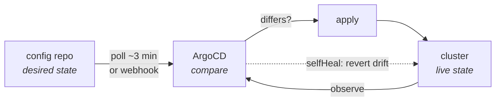

# ArgoCD

> [!abstract] Git is the source of truth; the cluster is a cache
> ArgoCD runs inside the cluster, watches a git repo, and continuously makes the
> cluster match it. Nothing pushes to the cluster — ArgoCD **pulls**. That
> inversion is the whole of GitOps.



---

## Why pull beats push

| | Push (Jenkins runs `kubectl`) | Pull (ArgoCD) |
|---|---|---|
| Cluster credentials | live in CI, permanently | never leave the cluster |
| Cluster reachable from | CI must reach the API server | ArgoCD reaches *out* to git |
| "What is deployed?" | read a build log | `git log` |
| Manual `kubectl edit` | undetected forever | flagged as **OutOfSync**, or reverted |
| Rollback | re-run an old build | `git revert` |
| Audit trail | Jenkins history | signed, reviewed commits |

---

## Install

```bash
kubectl create namespace argocd
kubectl apply -n argocd -f https://raw.githubusercontent.com/argoproj/argo-cd/stable/manifests/install.yaml
kubectl -n argocd rollout status deploy/argocd-server --timeout=300s

kubectl -n argocd get secret argocd-initial-admin-secret \
  -o jsonpath='{.data.password}' | base64 -d; echo

kubectl -n argocd port-forward svc/argocd-server 8081:443
# https://127.0.0.1:8081 — admin / <that password>
```

CLI (optional but faster than the UI):

```bash
sudo curl -sSL -o /usr/local/bin/argocd \
  https://github.com/argoproj/argo-cd/releases/latest/download/argocd-linux-amd64
sudo chmod +x /usr/local/bin/argocd
argocd login 127.0.0.1:8081 --username admin --insecure
```

---

## The Application object

```yaml
apiVersion: argoproj.io/v1alpha1
kind: Application
metadata:
  name: wings-portal-staging
  namespace: argocd                    # Applications live in argocd, always
  finalizers:
    - resources-finalizer.argocd.argoproj.io
spec:
  project: default
  source:
    repoURL: https://github.com/sylthecatto/wings-portal-config.git
    targetRevision: main
    path: overlays/staging             # ← manifests ONLY below this path
  destination:
    server: https://kubernetes.default.svc
    namespace: wings-staging
  syncPolicy:
    automated: { prune: true, selfHeal: true }
    syncOptions: [ CreateNamespace=true ]
```

| Field | Meaning | Gets you |
|---|---|---|
| `path` | subdirectory ArgoCD renders | pointing it at an app repo → `ComparisonError` |
| `targetRevision` | branch, tag, or SHA | `HEAD` follows the default branch |
| `destination.namespace` | where objects go **if** they declare none | overridden by in-manifest `namespace:` |
| `finalizers` | delete the workloads when the App is deleted | without it, deleting orphans them |

### syncPolicy, precisely

| Setting | Does | The surprise |
|---|---|---|
| `automated` | syncs on detected drift | without it you sync by hand |
| `prune: true` | deletes objects removed from git | off by default — deleted manifests linger |
| `selfHeal: true` | reverts live edits back to git | **your `kubectl edit` undoes itself in ~30s** |
| `CreateNamespace=true` | creates the destination namespace | without it: `namespaces "x" not found` |

> [!warning] "My change reverted itself"
> That is `selfHeal` working. Git is authoritative — edit git, not the cluster.
> To experiment live, set `selfHeal: false` temporarily and remember to restore it.

---

## The four failure modes you will actually hit

> [!danger]- `ComparisonError` — `Object 'Kind' is missing`
> ```
> Failed to load target state: Object 'Kind' is missing in
> '{"lockfileVersion":3,...}'
> ```
> The `path` points at a directory containing non-manifest files. ArgoCD's
> directory source parses **every** file as Kubernetes YAML, hits
> `package-lock.json` / `requirements.txt`, finds no `kind:`, and aborts the
> whole comparison. Sync status goes `Unknown` and nothing deploys.
>
> **Fix:** point at a manifests-only repo and path. This is the single strongest
> argument for the two-repo split.

> [!danger]- `SharedResourceWarning` — two Applications, one object
> ```
> Deployment/wings-portal is part of applications
> wings-portal-staging and wings-portal-production
> ```
> Both overlays declare the same effective namespace and name, so both
> Applications own the same object and each reverts the other. The pods flap.
>
> **Fix:** the *rendered* namespace and name decide ownership. Give each
> environment its own namespace (`wings-staging` / `wings-prod`) and a
> `namePrefix`. If you use NodePorts, they are cluster-wide — those must differ too.

> [!danger]- `namespaces "wings-staging" not found`
> ArgoCD does not create the destination namespace by default.
> **Fix:** `syncOptions: [CreateNamespace=true]` — which also survives someone
> deleting it later.

> [!danger]- Permanently `OutOfSync` on a field you never set
> A mutating admission controller or a defaulting webhook writes a field back
> after every sync, so live never equals git.
> **Fix:** tell ArgoCD to ignore it:
> ```yaml
> spec:
>   ignoreDifferences:
>     - group: apps
>       kind: Deployment
>       jsonPointers: [/spec/replicas]   # e.g. when an HPA owns replicas
> ```

---

## Sync waves and hooks

Order resources when something must exist first:

```yaml
metadata:
  annotations:
    argocd.argoproj.io/sync-wave: "-1"    # lower runs earlier; default 0
```

Run a one-off Job around a sync:

```yaml
metadata:
  annotations:
    argocd.argoproj.io/hook: PreSync      # PreSync | Sync | PostSync | SyncFail
    argocd.argoproj.io/hook-delete-policy: HookSucceeded
```

`PreSync` is where database migrations go — they must complete before the new
pods start.

---

## App of apps

One Application whose manifests are *other* Applications. Bootstrap a whole
cluster from a single `kubectl apply`:

```yaml
spec:
  source:
    repoURL: https://github.com/sylthecatto/wings-portal-config.git
    path: argocd                # the directory holding app-*.yaml
```

Adding an environment then means committing a file, not running a command.

---

## Day-to-day commands

```bash
argocd app list
argocd app get wings-portal-staging
argocd app diff wings-portal-staging        # git vs live, before syncing
argocd app sync wings-portal-staging
argocd app history wings-portal-staging
argocd app rollback wings-portal-staging 12
argocd app set wings-portal-staging --revision main
```

Without the CLI:

```bash
kubectl -n argocd get applications
kubectl -n argocd get app wings-portal-staging \
  -o custom-columns=SYNC:.status.sync.status,HEALTH:.status.health.status

# the conditions field is where the real error text lives
kubectl -n argocd get app wings-portal-staging \
  -o jsonpath='{range .status.conditions[*]}{.type}: {.message}{"\n"}{end}'
```

| Sync status | Meaning |
|---|---|
| `Synced` | live matches git |
| `OutOfSync` | they differ — expected right after a CI commit |
| `Unknown` | ArgoCD **could not render git at all** → read `conditions` |

| Health | Meaning |
|---|---|
| `Healthy` | all resources report ready |
| `Progressing` | rollout in flight |
| `Degraded` | probes failing, pods crashing |
| `Missing` | in git, absent from the cluster |

---

## Faster feedback

Default polling is ~3 minutes. To make ArgoCD react instantly, point a GitHub
webhook at `https://<argocd-host>/api/webhook`. In this lab, ngrok would have to
tunnel ArgoCD as well as Jenkins — usually not worth it. Just click **Refresh**,
or:

```bash
argocd app get wings-portal-staging --refresh
```

---

See also: [[00 — CI-CD Master Guide]] · [[03 — Kubernetes]] · [[05 — Troubleshooting]]
